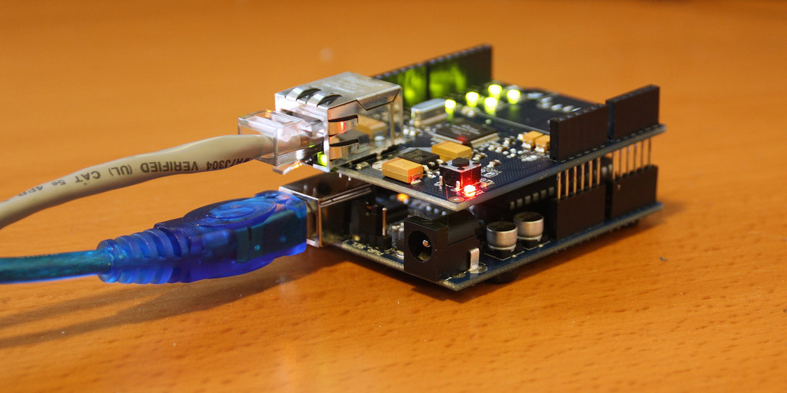
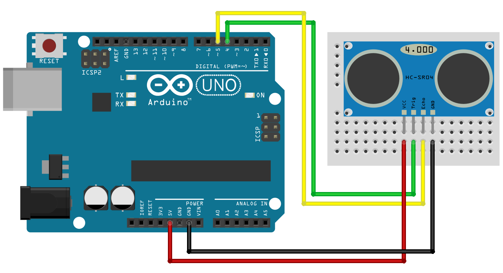
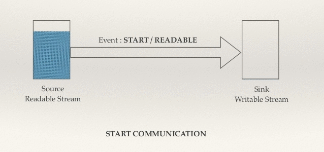
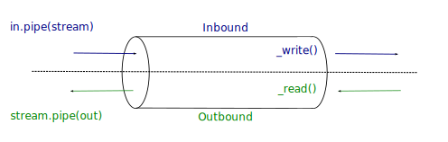

# Arduino to Node.js
# <i class="br br-arduino-notext"></i> ⬌ <i class="br br-nodejs"></i> &nbsp;

_Sending messages from [Arduino][ino] board to a [Node.js][node] application._

<small>Version 0.1.0</small>

[ino]: http://arduino.cc/
[node]: https://nodejs.org/

====

<!-- .slide: class="half-slide" data-background="url(img/paulodiovani.jpg)" data-background-size="contain" data-background-repeat="no-repeat" data-background-position="right" -->

### <i class="fa fa-user"></i> Paulo Diovani Gonçalves

Technologist in Internet Systems by Feevale University.
Software Enginer at Codeminer 42.
GNU/Linux user since 2005.

[blog.diovani.com][blog]

[slides.diovani.com][slides]

[@paulodiovani][twitter]

[![codeminer42][code-logo]][code-site] <!-- .element: class="no-border no-background" -->

[avatar]: img/avatar.jpg
[blog]: http://blog.diovani.com
[slides]: http://slides.diovani.com
[twitter]: http://twitter.com/paulodiovani
[code-logo]: img/codeminer42.png
[code-site]: http://codeminer42.com/

====

# <i class="br br-codeminer" style="font-size: 3em;"></i>

**we're hiring**<br>
[become@codeminer42.com](mailto:become@codeminer42.com)

Note:
Any questions talk to me. ;)

----
<!-- .slide: data-background="linear-gradient(rgba(255, 255, 255, 0.65), rgba(255, 255, 255, 0.65)), url(img/lazy-parking.jpg)" data-background-size="cover" -->

A proof of concept for...

# <i class="fa fa-map-marker"></i> <i class="fa fa-car"></i>
## Lazy Parking

_Internet Systems Technology &ndash;
[Feevale University](http://feevale.br)_<br>
_Interdisciplinary Project I &ndash; 2015_

Note:
Curious about the project?

Talk to me later.

====
<!-- .slide: data-background="linear-gradient(rgba(255, 255, 255, 0.65), rgba(255, 255, 255, 0.65)), url(img/johnny-five.jpg)" data-background-size="cover" -->

# <i class="br br-johnny-five"></i>

### We're not talking about Johnny-Five. Sorry.

But worth take a look at [johnny-five.io](http://johnny-five.io/).

Note:
Johnny-Five is a Node.js Library used for
prototyping with many different board.

----

## Writing Arduino code

The arduino _sketch_ structure.

```c++
void setup()
{
    // Called when a sketch starts
    // Use it to initialize variables, pin modes, etc.
    // Runs once
}

void loop()
{
    // Called just after setup()
    // Use it to actively control the Arduino board.
    // Loops consecutively.
}
```

Note:
Arduino code is based on C++ but with
it's own commands and librearies

====
<!-- .slide: data-background="linear-gradient(rgba(255, 255, 255, 0.65), rgba(255, 255, 255, 0.65)), url(img/arduino-ultrasonic.jpg)" data-background-size="cover" -->

# <i class="fa fa-question-circle-o"></i>

### How to send sensor data to a web server?

We're using a ultrasonic sensor for example,
but could be any sensor. <!-- .element: class="small" -->

- ~~Serial/USB port~~
- TCP Socket

http://blog.filipeflop.com/sensores/sensor-ultrassonico-hc-sr04-ao-arduino.html <!-- .element: class="credits" -->

Note:
This is our main problem.

- For serial/USB port the Arduino must be
physicaly conected to the server.

====
<!-- .slide: data-background="linear-gradient(rgba(255, 255, 255, 0.65), rgba(255, 255, 255, 0.65)), url(img/arduino-ethernet.jpg)" data-background-size="cover" data-background-position="center" -->

## Arduino Ethernet Shield

https://www.arduino.cc/en/Main/ArduinoEthernetShield

- Allow TCP/IP connections
- Can get a DHCP address
- Read/Write to SD Card

http://www.arduino.cc <!-- .element: class="credits" -->

Note:
So we decided to use Ethernet Shield.

====

### Assembling Ethernet Shield



https://www.flickr.com/photos/bpunkt/3141966707 <!-- .element: class="credits" -->

Note:
Ethernet Shield fits on top of Arduino Uno.

====

### Assembling Ultrasonic Sensor



http://blog.filipeflop.com/sensores/sensor-ultrassonico-hc-sr04-ao-arduino.html <!-- .element: class="credits" -->

----

## Defining a protocol

> [...] a communication protocol is a system of rules that allow two or more entities of a communications system to transmit information [...]

_Source: Wikipedia_ <!-- .element: class="small" -->

Note:
For any kind of net communication it makes
necessary to define a protocol.

====

Rules or standard that defines...

-  syntax
-  semantics
-  synchronization of communication
-  error recovery methods

====

### Example: HTTP

```http
GET /index.html HTTP/1.1
Host: www.example.com
```

```http
HTTP/1.1 200 OK
Date: Mon, 23 May 2005 22:38:34 GMT
Content-Type: text/html; charset=UTF-8
Content-Encoding: UTF-8
Content-Length: 138
Last-Modified: Wed, 08 Jan 2003 23:11:55 GMT
Server: Apache/1.3.3.7 (Unix) (Red-Hat/Linux)
ETag: "3f80f-1b6-3e1cb03b"
Accept-Ranges: bytes
Connection: close

<html>
...
```

====

### Our protocol

We are just using plaing text JSON.

```json
{
  "distance": 99,
  "unit": "cm"
}
```

name     | type   | default
--       | --     | --
distance | number |
unit     | string | cm

----

# <i class="br br-arduino"></i>

## Arduino Sketch

Source code available at GitHub<!-- .element: class="small" -->

[paulodiovani/arduino2node][arduino-repos]&nbsp;/&nbsp;[arduino/distance/distance.ino][arduino-file]

[arduino-repos]: https://github.com/paulodiovani/arduino2node
[arduino-file]: https://github.com/paulodiovani/arduino2node/tree/master/arduino/distance/distance.ino

Note:
- `setup()`
    + set sensor pin modes
    + connect to server
- `loop()`
    + read sensor data
    + send data to server

====

# <i class="br br-nodejs"></i>
## Node.js web app

Source code available at GitHub<!-- .element: class="small" -->

[paulodiovani/arduino2node][nodejs-repos]&nbsp;/&nbsp;[nodejs][nodejs-files]

[nodejs-repos]: https://github.com/paulodiovani/arduino2node
[nodejs-files]: https://github.com/paulodiovani/arduino2node/tree/master/nodejs

Note:
- `web`
    A simple Express.js app with
    `socket.io` attached (not shown).
- `tcp-socket`
    + receives messages from net socket
    + send to browser

====

# <i class="fa fa-code"></i>

## Front-end code

Source code available at GitHub<!-- .element: class="small" -->

[paulodiovani/arduino2node][browser-repos]&nbsp;/&nbsp;[nodejs/views/index.ejs][browser-code]

[browser-repos]: https://github.com/paulodiovani/arduino2node
[browser-code]: https://github.com/paulodiovani/arduino2node/tree/master/nodejs/views/index.ejs

Note:
- update DOM with `socket.io` events data

----

## Mostly Relevant code

====

Arduino sends data through TCP Socket

```c++
EthernetClient client;

void setup() {
  //[...]
  Ethernet.begin(mac, ip);
  client.connect(server, 4000);
  //[...]
}

void loop() {
  //[...]
  client.print("{\"distance\":" + String(cm) + ",\"unit\":\"cm\"}");

  delay(1000);
}
```

====

Node server reads data received on TCP Port

```js
const onMsgReceived = function(data) {
  const json = JSON.parse(data.toString());
  Io.emit('arduino:message', json);
};

const socket = Net.createServer((client) => {
    client.on('data', onMsgReceived);
});

socket.listen(4000);
```

Note:
The `stream.on` is the easiest/simplier
way to make it done.

But it's not the best.

====

```js
client instanceof Stream
```
<!-- .element: class="big align-center" -->

https://nodejs.org/api/stream.html

====
<!-- .slide: data-background="linear-gradient(rgba(255, 255, 255, 0.65), rgba(255, 255, 255, 0.65)), url(img/water-dam.gif)" data-background-size="cover" data-background-position="center" -->

### Stream events



http://www.slideshare.net/kushallikhi/streams-in-node-js <!-- .element: class="credits" -->

http://www.spk.usace.army.mil/Missions/Civil-Works/Dam-Safety-Program/ <!-- .element: class="credits" -->

Note:
We're listening to stream events

====
<!-- .slide: data-background="linear-gradient(rgba(255, 255, 255, 0.65), rgba(255, 255, 255, 0.65)), url(img/water-dam.gif)" data-background-size="cover" data-background-position="center" -->

- Constant flow of data

- Arduino can't control the init/end of messages

  ```c++
  void loop() {
    //[...]
    //delay(1000);
  }
  ```
  <!-- .element: class="fragment" data-fragment-index="1" -->

  <i class="fa fa-warning"></i> Messages can be joined together.
  <!-- .element: class="fragment" data-fragment-index="2" -->

  ```json
  {"distance":17,"unit":"cm"}{"distance":20,"unit":"cm"}
  ```
  <!-- .element: class="fragment" data-fragment-index="2" -->

http://www.spk.usace.army.mil/Missions/Civil-Works/Dam-Safety-Program/ <!-- .element: class="credits" -->

Note:
Can you see the problem here?

====
<!-- .slide: data-background="linear-gradient(rgba(255, 255, 255, 0.65), rgba(255, 255, 255, 0.65)), url(img/water-dam.gif)" data-background-size="cover" data-background-position="center" -->

```js
> JSON.parse('{"distance":17,"unit":"cm"}{"distance":20,"unit":"cm"}');
SyntaxError: Unexpected token `{` in JSON at position 27
    at Object.parse (native)
    at repl:1:6
    at REPLServer.defaultEval (repl.js:272:27)
    at bound (domain.js:280:14)
    at REPLServer.runBound [as eval] (domain.js:293:12)
    at REPLServer.<anonymous> (repl.js:441:10)
    at emitOne (events.js:101:20)
    at REPLServer.emit (events.js:188:7)
    at REPLServer.Interface._onLine (readline.js:219:10)
    at REPLServer.Interface._line (readline.js:561:8)
```

_<i class="fa fa-warning"></i> Fails spectacularly!! <i class="fa fa-bomb"></i>_ <!-- .element: class="big" -->

http://www.spk.usace.army.mil/Missions/Civil-Works/Dam-Safety-Program/ <!-- .element: class="credits" -->

Note:
Can't parse inconsistent JSON

====
<!-- .slide: data-background="linear-gradient(rgba(255, 255, 255, 0.65), rgba(255, 255, 255, 0.65)), url(img/pipes.gif)" data-background-size="cover" data-background-position="center" -->

### Using Streams

 <!-- .element: class="wide" -->

http://codewinds.com/blog/2013-08-31-nodejs-duplex-streams.html <!-- .element: class="credits" -->

http://bojackhorseman.com/ <!-- .element: class="credits" -->

Note:
- Streams are interpreted as a pipe.
- And we use the `pipe()` method

====
<!-- .slide: data-background="linear-gradient(rgba(255, 255, 255, 0.65), rgba(255, 255, 255, 0.65)), url(img/pipes.gif)" data-background-size="cover" data-background-position="center" -->

Use `pipe()` instead of events.

```js
const browserStream = new Stream.Writable({
  write: function(chunk, encoding, callback) {
    const json = JSON.parse(chunk.toString());
    Io.emit('arduino:message', json);

    callback();
  }
});

client.pipe(browserStream);
```

http://bojackhorseman.com/ <!-- .element: class="credits" -->

====
<!-- .slide: data-background="linear-gradient(rgba(255, 255, 255, 0.65), rgba(255, 255, 255, 0.65)), url(img/pipes.gif)" data-background-size="cover" data-background-position="center" -->

```js
const splitStream = new Stream.Transform({
  transform: function(chunk, encoding, callback) {
    const text = chunk.toString();
    const re = /(\{[^\}]*\})/;
    const jsonArr = text.split(re).filter((j) => j != '');

    jsonArr.map((j) => this.push(j));

    callback();
  }
});

client
  .pipe(splitStream)
  .pipe(browserStream);
```

Better. <i class="fa fa-smile-o"></i>

http://bojackhorseman.com/ <!-- .element: class="credits" -->

Note:
Solution: Use a transform stream to split data.

----

# Time for Action <i class="fa fa-youtube-play"></i>

====
<!-- .slide: data-background="img/picture-arduino.jpg" -->

Note:
The sensor setup (real picture)

====
<!-- .slide: data-background="img/picture-webserver.jpg" -->

Note:
The app on browser.

----

# 🤔

# Conclusions

====

## Challenges

- First attempt in IoT
- Dealing with low level communications
- Defining a protocol

Note:
Thinking of the project Lazy Parking

====

## Caveats

- Arduino is NOT commercial viable
- Depends on strong _security rules_
- Depends on stronger _error handling_

Note:
Thiking of making something available to
others, in internet or to make profit

====

## Possibilities

- House automation
- Realtime measurements
- Communication gadgets
- Etc.

----

# <i class="fa fa-question-circle-o"></i>

# Questions?

====

### Credits

by Paulo Diovani Gonçalves

<small>[@paulodiovani](http://twitter.com/paulodiovani)</small><br>
<small>[paulo@diovani.com]((mailto:paulo@diovani.com)</small>

_powered by: [reveal.js](http://lab.hakim.se/reveal-js/)_

<small>[http://lab.hakim.se/reveal-js/](http://lab.hakim.se/reveal-js/)</small>

<a rel="license" href="http://creativecommons.org/licenses/by-nc-sa/4.0/"></a>
<span xmlns:dct="http://purl.org/dc/terms/" property="dct:title">Arduino to Node.js</span> by <a xmlns:cc="http://creativecommons.org/ns#" href="http://diovani.com" property="cc:attributionName" rel="cc:attributionURL">Paulo Diovani</a> is licensed under a <a rel="license" href="http://creativecommons.org/licenses/by-nc-sa/4.0/">Creative Commons Attribution-NonCommercial-ShareAlike 4.0 International License</a>.
