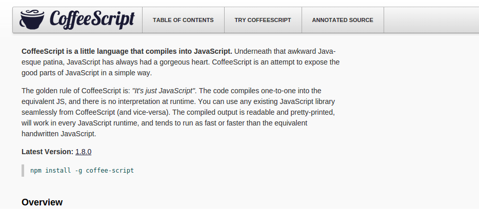
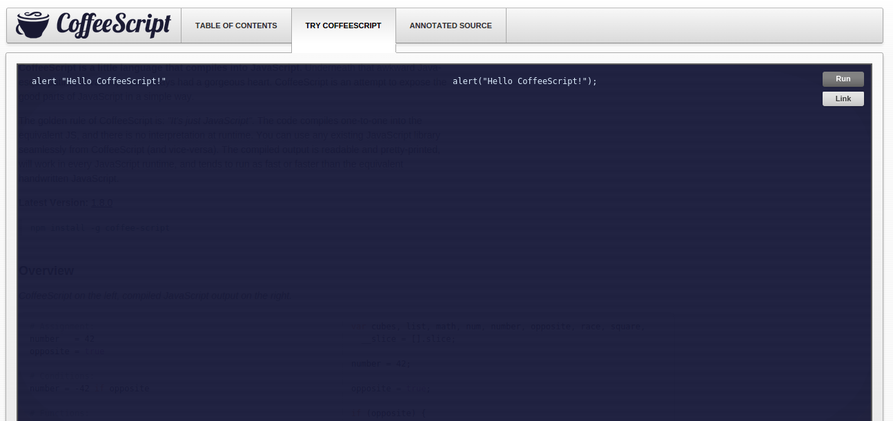

 <!-- .element: class="no-border no-background" -->

_tome um gole de café_

<small>Versão 0.2.4</small>

====
<!-- .slide: class="author" -->

#### Paulo Diovani Gonçalves

*  <!-- .element: class="pull-right" -->
* Desenvolvedor na Codeminer 42.
* Graduando em Sistemas para Internet na Universidade Feevale.
* Já palestrou em eventos FLISOL e Dia da Liberdade de Software.
* Usuário GNU/Linux desde 2005.
* PHP, Javascript, Node.js, Ruby, Python, Arduino.
* Entusiasta de novas tecnologias.
*  <!-- .element: class="pull-right no-border" -->

====

Acesse os slides em

[slides.diovani.com/slides-coffeescript](http://slides.diovani.com/slides-coffeescript/)

<small>[<i class="fa fa-github"></i> contribua](https://github.com/paulodiovani/reveal.js-slides)</small>

----

_CoffeeScript_ é uma pequena liguagem que compila em Javascript.

====
<!-- .slide: class="compile" -->

###### CoffeeScript <i class="fa fa-arrow-circle-right"></i> Javascript

```coffeescript
# Assignment:
number   = 42
opposite = true

# Conditions:
number = -42 if opposite

# Functions:
square = (x) -> x * x
```

```javascript
var number, opposite, square;

number = 42;

opposite = true;

if (opposite) {
  number = -42;
}

square = function(x) {
  return x * x;
};
```

Note:
Alguns exemplos simples

====

> É apenas Javascript

* compilação 1 para 1
* sem interpretação em tempo de execução
* uso transparente de qualquer biblioteca Javascript
* Javascript gerado é legível e bem formatado e pode ser executado
  qualquer _engine_ Javascript

Note:
"É apenas Javascript" significa que a linguagem
não adicionada nenhuma funcionalidade nova ao Js.

Em outras palavras, nada que não é possível em
Javascript pode ser feito em CoffeeScript.

----

### Introdução

====

Criada em Dezembro de 2009 por _Jeremy Ashkenas_.

Inspirada em linguagens mais modernas como _Python_,
_Ruby_ e _Haskell_.

====

CoffeeScript permite escrever Javascript de forma
mais breve e legível.

* Blocos separados por indentação
* Parênteses, chaves e vírgulas são opcionais
* "Tudo é uma expressão"

====

#### Website e documentação



====

#### Experimente CoffeeScript



====

#### Instalação

O compilador de linha de comando  do CoffeeScript está disponível
como um utilitário em Node.js e deve ser instalado via NPM.

    npm install -g coffee-script

====

#### Forma de uso <small>do compilador</small>

    coffee -c script.coffee

Principais opções:

    -c  --compile   gera *.js para cada *.coffee
    -j  --join      concatena scripts antes de compilar
    -o  --output    define o diretório de saida
    -p  --print     imprime o javascript compilado
    -w  --watch     observa scripts por modificações
    -m  --map       gera source maps

----

### Parte 1: Variáveis e Strings

====
<!-- .slide: class="compile" -->

#### Variáveis

###### CoffeeScript <i class="fa fa-arrow-circle-right"></i> Javascript

```coffeescript
message = "Ready for some Coffee?"
alert(message)
```

```javascript
var message;
message = "Ready for some Coffee?";
alert(message);
```

* sem declaração de variáveis
* sem ponto-e-vírgula

====
<!-- .slide: class="compile" -->

#### Interpolação de Strings

###### CoffeeScript <i class="fa fa-arrow-circle-right"></i> Javascript

```coffeescript
author = "Wittgenstein"
quote  =
  "A picture is a fact. -- #{ author }"

sentence = "#{ 22 / 7 } is a decent
  approximation of π"
```

```javascript
var author, quote, sentence;

author = "Wittgenstein";

quote = "A picture is a fact. -- " + author;

sentence = "" + (22 / 7) + " is a decent approximation of π";
```

* O uso de `#{}` permite adicionar variáveis dentro de uma string
* Não apenas variáveis, mas qualquer código CoffeeScript

====
<!-- .slide: class="compile" -->

#### Strings em múltiplas linhas

###### CoffeeScript <i class="fa fa-arrow-circle-right"></i> Javascript

```coffeescript
mobyDick = "Call me Ishmael.Some years 
  ago - never mind how long precisely - 
  having little or no money in my purse,
  and nothing particular to interest me
  on shore, I thought I would sail about
  a  little and see the watery part of
  the world..."
```

```javascript
var mobyDick;

mobyDick = "Call me Ishmael.Some years ago - never mind how long precisely - having little or no money in my purse, and nothing particular to interest me on shore, I thought I would sail about a  little and see the watery part of the world...";
```

* strings em múltiplas linhas são permitidas
* linhas são concatenadas com um único espaço,
  a menos que terminem com uma barra invertida.
* indentação é ignorada

====
<!-- .slide: class="compile" -->

#### Blocos de Strings

###### CoffeeScript <i class="fa fa-arrow-circle-right"></i> Javascript

```coffeescript
html = """
       <strong>
         cup of coffeescript
       </strong>
       """
```

```javascript
var html;

html = "<strong>\n  cup of coffeescript\n</strong>";
```

* blocos de strings são usados para manter texto formatado
  ou sensível a indentação
* a indentação onde se iniciou o bloco é ignorada, permitindo
  manter o código alinhado

----

### Parte 2: Funções

====
<!-- .slide: class="compile" -->

#### _The arrow_ (`->`)

###### CoffeeScript <i class="fa fa-arrow-circle-right"></i> Javascript

```coffeescript
coffee = ->
  confirm "Read for some Coffee?"

coffee()
```

```javascript
var coffee;

coffee = function() {
  return confirm("Read for some Coffee?");
};

coffee();
```

* apenas _function expressions_
* sempre retornam um valor

====
<!-- .slide: class="compile" -->

#### Argumentos para funções

###### CoffeeScript <i class="fa fa-arrow-circle-right"></i> Javascript

```coffeescript
sayMyName = (name) ->
  console.log name
```

```javascript
var sayMyName;

sayMyName = function(name) {
  return console.log(name);
};
```

* definidos entre parênteses, antes da `->
`
====
<!-- .slide: class="compile" -->

#### valores padrão

###### CoffeeScript <i class="fa fa-arrow-circle-right"></i> Javascript

```coffeescript
sayMyName = (name = "Heinsenberg") ->
  console.log name
```

```javascript
var sayMyName;

sayMyName = function(name) {
  if (name == null) {
    name = "Heinsenberg";
  }
  return console.log(name);
};
```

* utilizando um `=`

====
<!-- .slide: class="compile" -->

#### executando funções

###### CoffeeScript <i class="fa fa-arrow-circle-right"></i> Javascript

```coffeescript
coffee()

sayMyName("Paulo Diovani")

console.log "coffee", "script"

alert confirm("Ready for Coffee?")

caution using functions arguments
```

```javascript
coffee();

sayMyName("Paulo Diovani");

console.log("coffee", "script");

alert(confirm("Ready for Coffee?"));

caution(using(functions(arguments)));
```

* parênteses são opcionais
* mas obrigatórios quando não há argumentos

====
<!-- .slide: class="compile" -->

#### Splats

número variável de argumentos

###### CoffeeScript <i class="fa fa-arrow-circle-right"></i> Javascript

```coffeescript
winners = (first, second, losers...) ->
  console.log "congrats #{first}"
  console.log "almos there #{second}"

  for loser in losers
    console.log "too bad #{loser}"

winners "John", "Louise", "Robert", "Adrian"
# congrats John
# almos there Louise
# too bad Robert
# too bad Adrian
```

```javascript
var winners,
  __slice = [].slice;

winners = function() {
  var first, loser, losers, second, _i, _len, _results;
  first = arguments[0], second = arguments[1], losers = 3 <= arguments.length ? __slice.call(arguments, 2) : [];
  console.log("winner is " + first);
  console.log("almos there is " + second);
  _results = [];
  for (_i = 0, _len = losers.length; _i < _len; _i++) {
    loser = losers[_i];
    _results.push(console.log("too bad " + loser));
  }
  return _results;
};

winners("John", "Louise", "Robert", "Adrian");
```

* o `splats` (sempre por último) recebe um
  array com o restante dos argumentos

====
<!-- .slide: class="compile" -->

#### variável `@` e escopo <small>(ou _binding_)</small>

###### CoffeeScript <i class="fa fa-arrow-circle-right"></i> Javascript

```coffeescript
Account = (customer, cart) ->
  @customer = customer
  @cart = cart

  $('.cart').on 'click', (e) =>
    @customer.purchase @cart
```

```javascript
var Account;

Account = function(customer, cart) {
  this.customer = customer;
  this.cart = cart;
  return $('.cart').on('click', (function(_this) {
    return function(e) {
      return _this.customer.purchase(_this.cart);
    };
  })(this));
};
```

* `@` = `this`
* `@foo` = `this.foo`
* o uso de uma _fat arrow_ (`=>`) faz um bind da função
  para uso com o escopo (`this`) superior

----

### Parte 3: Operadores e condições

====
<!-- .slide: class="compile" -->

#### if

###### CoffeeScript <i class="fa fa-arrow-circle-right"></i> Javascript

```coffeescript
if (age >= 18)
  "drink beer"

if age < 18
  "drink coffee"
```

```javascript
if (age >= 18) {
  "drink beer";
}

if (age < 18) {
  "drink coffee";
}
```

* Parênteses são opcionais

====
<!-- .slide: class="compile" -->

#### reduzindo as linhas

###### CoffeeScript <i class="fa fa-arrow-circle-right"></i> Javascript

```coffeescript
if age >= 18 then "drink beer" else "drink coffee"
```

```javascript
if (age >= 18) {
  "drink beer";
} else {
  "drink coffee";
}
```

* Não existe operador ternário (`a ? b : c`)

====
<!-- .slide: class="compile" -->

#### Operadores

###### CoffeeScript <i class="fa fa-arrow-circle-right"></i> Javascript

```coffeescript
== is
!= isnt
not
and
or
true yes on
false no off
```

```javascript
===
!==
!
&&
||
true
false
```

====
<!-- .slide: class="compile" -->

#### Exemplos, `unless` e operadores encadeados

###### CoffeeScript <i class="fa fa-arrow-circle-right"></i> Javascript

```coffeescript
if paid() and coffee() is on then pour()

addCaffeine() if not Decaf()
addCaffeine() unless Decaf()

if 2 < newLevel < 5
  alert "In Range!"
```

```javascript
if (paid() && coffee() === true) {
  pour();
}

if (!Decaf()) {
  addCaffeine();
}
if (!Decaf()) {
  addCaffeine();
}

if ((2 < newLevel && newLevel < 5)) {
  alert("In Range!");
}
```

====
<!-- .slide: class="compile" -->

#### Operator de existência

###### CoffeeScript <i class="fa fa-arrow-circle-right"></i> Javascript

```coffeescript
drink(coffee) if coffee?
```

```javascript
if (typeof coffee !== "undefined" && coffee !== null) {
  drink(coffee);
}
```

* verifica se variável está definida e não é nula

====
<!-- .slide: class="compile" -->

#### Switch

###### CoffeeScript <i class="fa fa-arrow-circle-right"></i> Javascript

```coffeescript
switch hasSugar
  when yes
    dontPutSugar()
  when "stevia", "aspartame"
    dontPutSugar()
  else
    putSugar()
```

```javascript
switch (hasSugar) {
  case true:
    dontPutSugar();
    break;
  case "stevia":
  case "aspartame":
    dontPutSugar();
    break;
  default:
    putSugar();
}
```

* sempre adiciona breaks
* porém, pode combinar condições com `,`

====
<!-- .slide: class="compile" -->

#### Switch

###### CoffeeScript <i class="fa fa-arrow-circle-right"></i> Javascript

```coffeescript
message = switch cupsOfCoffee
  when 0 then 'Asleep'
  when 1 then 'Eyes Open'
  when 2 then 'Buzzed'
  else 'Dangerous'
```

```javascript
var message;

message = (function() {
  switch (cupsOfCoffee) {
    case 0:
      return 'Asleep';
    case 1:
      return 'Eyes Open';
    case 2:
      return 'Buzzed';
    default:
      return 'Dangerous';
  }
})();
```

* switches podem também retornar um valor
    - Lembre-se: "tudo é uma expressão"

====
<!-- .slide: class="compile" -->

#### Switch

###### CoffeeScript <i class="fa fa-arrow-circle-right"></i> Javascript

```coffeescript
score = 76
grade = switch
  when score < 60 then 'F'
  when score < 70 then 'D'
  when score < 80 then 'C'
  when score < 90 then 'B'
  else 'A'
```

```javascript
var grade, score;

score = 76;

grade = (function() {
  switch (false) {
    case !(score < 60):
      return 'F';
    case !(score < 70):
      return 'D';
    case !(score < 80):
      return 'C';
    case !(score < 90):
      return 'B';
    default:
      return 'A';
  }
})();
```

* switches podem ainda ser usados sem uma expressão de controle,
  tornando-os uma alternativa a `if`s aninhados


----

### Parte 4: Arrays e Objetos

====
<!-- .slide: class="compile" -->

#### Séries

###### CoffeeScript <i class="fa fa-arrow-circle-right"></i> Javascript

```coffeescript
range = [1..6]
range = [1...6]

console.log range[2..4]
# [2, 3, 4]
console.log range[2...4]
# [2, 3, 4]
```

```javascript
var range;

range = [1, 2, 3, 4, 5, 6];
range = [1, 2, 3, 4, 5];

console.log(range.slice(2, 5));
console.log(range.slice(2, 4));
```

* três pontos excluem o último item

Note:
Opções em coffee fazem o mesmo

====
<!-- .slide: class="compile" -->

#### Arrays

###### CoffeeScript <i class="fa fa-arrow-circle-right"></i> Javascript

```coffeescript
cities = ['Porto Alegre', 'Novo Hamburgo', 'São Paulo']

cities = [
  'Porto Alegre'
  'Novo Hamburgo'
  'São Paulo'
]
```

```javascript
var cities;

cities = ['Porto Alegre', 'Novo Hamburgo', 'São Paulo'];
```

* Pode usar linhas ao invés de vírgulas

Note:
Opções em coffee fazem o mesmo

====
<!-- .slide: class="compile" -->

#### Loops compreensíveis

###### CoffeeScript <i class="fa fa-arrow-circle-right"></i> Javascript

```coffeescript
visit city for city in cities
```

```javascript
var city, _i, _len;

for (_i = 0, _len = cities.length; _i < _len; _i++) {
  city = cities[_i];
  visit(city);
}
```

* Leia: _"visite cidade para cada cidade em cidades"_

====
<!-- .slide: class="compile" -->

#### Objetos

###### CoffeeScript <i class="fa fa-arrow-circle-right"></i> Javascript

```coffeescript
coffee = {type: "expresso", hasSuggar: false}

coffee = type: "expresso", hasSuggar: false

coffee =
  type: "expresso"
  hasSuggar: false
  putSuggar: ->
    @hasSuggar = true
```

```javascript
var coffee;

coffee = {
  type: "expresso",
  hasSuggar: false,
  putSuggar: function() {
    return this.hasSuggar = true;
  }
};
```

* chaves são opcionais
* vírgulas são opcionais (separados por linhas)

Note:
Opções em coffee fazem o mesmo

====
<!-- .slide: class="compile" -->

#### Objetos complexos

###### CoffeeScript <i class="fa fa-arrow-circle-right"></i> Javascript

```coffeescript
coffees =
  french:
    strength: 1
    in_stock: 20
  italian:
    strength: 2
    in_stock: 12
  decaf:
    strength: 0
    in_stock: 8
```

```javascript
var coffees;

coffees = {
  french: {
    strength: 1,
    in_stock: 20
  },
  italian: {
    strength: 2,
    in_stock: 12
  },
  decaf: {
    strength: 0,
    in_stock: 8
  }
};
```

====
<!-- .slide: class="compile" -->

#### Iteração de objetos

###### CoffeeScript <i class="fa fa-arrow-circle-right"></i> Javascript

```coffeescript
for coffee, attrs of coffees
  "#{coffee} has #{attrs.in_stock}"

"#{coffee} has #{attrs.in_stock}" for coffee, attrs of coffees
```

```javascript
var attrs, coffee;

for (coffee in coffees) {
  attrs = coffees[coffee];
  "" + coffee + " has " + attrs.in_stock;
}
```

* Leia: _"Para chave, valor de objeto"_

Note:
Opções em coffee fazem o mesmo

====
<!-- .slide: class="compile" -->

#### Extraindo valores

_Destructuring Assignment_

###### CoffeeScript <i class="fa fa-arrow-circle-right"></i> Javascript

```coffeescript
[city1, city2, city3] = cities

{type, hasSuggar} = coffee
```

```javascript
var city1, city2, city3, hasSuggar, type;

city1 = cities[0], city2 = cities[1], city3 = cities[2];

type = coffee.type, hasSuggar = coffee.hasSuggar;
```

====
<!-- .slide: class="compile" -->

#### Combinando "desestruturadores"

###### CoffeeScript <i class="fa fa-arrow-circle-right"></i> Javascript

```coffeescript
futurists =
  sculptor: "Umberto Boccioni"
  painter:  "Vladimir Burliuk"
  poet:
    name:   "F.T. Marinetti"
    address: [
      "Via Roma 42R"
      "Bellagio, Italy 22021"
    ]

{poet: {name, address: [street, city]}} = futurists
```

```javascript
var city, futurists, name, street, _ref, _ref1;

futurists = {
  sculptor: "Umberto Boccioni",
  painter: "Vladimir Burliuk",
  poet: {
    name: "F.T. Marinetti",
    address: ["Via Roma 42R", "Bellagio, Italy 22021"]
  }
};

_ref = futurists.poet, name = _ref.name, (_ref1 = _ref.address, street = _ref1[0], city = _ref1[1]);
```

----

### Parte 5: Classes

Note:
As coisas podem ficar complicadas a partir de agora

====
<!-- .slide: class="compile" -->

#### Construtores

###### CoffeeScript <i class="fa fa-arrow-circle-right"></i> Javascript

```coffeescript
class Coffee
  constructor: (name, strength = 1) ->
    @name = name
    @strength = strength
```

```javascript
var Coffee;

Coffee = (function() {
  function Coffee(name, strength) {
    if (strength == null) {
      strength = 1;
    }
    this.name = name;
    this.strength = strength;
  }

  return Coffee;

})();
```

====
<!-- .slide: class="compile" -->

#### Construtores <small>um pouco mais simples</small>

###### CoffeeScript <i class="fa fa-arrow-circle-right"></i> Javascript

```coffeescript
class Coffee
  constructor: (@name, @strength = 1) ->
```

```javascript
var Coffee;

Coffee = (function() {
  function Coffee(name, strength) {
    this.name = name;
    this.strength = strength != null ? strength : 1;
  }

  return Coffee;

})();
```

====
<!-- .slide: class="compile" -->

#### Métodos e propriedades

###### CoffeeScript <i class="fa fa-arrow-circle-right"></i> Javascript

```coffeescript
class Coffee
  hasSugar: false

  putSugar: ->
    @hasSugar = true
```

```javascript
var Coffee;

Coffee = (function() {
  function Coffee() {}

  Coffee.prototype.hasSugar = false;

  Coffee.prototype.putSugar = function() {
    return this.hasSugar = true;
  };

  return Coffee;

})();
```

====
<!-- .slide: class="compile" -->

#### Herança

###### CoffeeScript <i class="fa fa-arrow-circle-right"></i> Javascript

```coffeescript
class Cappuccino extends Coffee
  constructor: (@name, @strength = 0.5) ->
```

```javascript
var Cappuccino,
  __hasProp = {}.hasOwnProperty,
  __extends = function(child, parent) { for (var key in parent) { if (__hasProp.call(parent, key)) child[key] = parent[key]; } function ctor() { this.constructor = child; } ctor.prototype = parent.prototype; child.prototype = new ctor(); child.__super__ = parent.prototype; return child; };

Cappuccino = (function(_super) {
  __extends(Cappuccino, _super);

  function Cappuccino(name, strength) {
    this.name = name;
    this.strength = strength != null ? strength : 0.5;
  }

  return Cappuccino;

})(Coffee);
```

Note:
* Não se atentem muito com o Javascript compilado
  - Herança em Js não é legal :(

----

### Conclusão

====

#### Premissas

* você deve ser capaz de escrever e entender Javascript

> It's just Javascript

Note:
Sem conhecer Javascript é impossível escrever
bons códigos em CoffeeScript

====

#### <small>então</small> Por que usar CoffeeScript?

* código legível
* menos código / rápido de escrever / produtividade
* fácil de fazer loops e estruturas de controle
* melhor controle de escopo
* orientação a objetos compreensível e
  familiar com outras linguagens

====

<!-- .slide: data-background="img/coffee-art.png" -->

### Dúvidas?

Huh!?

====

### Fontes

* wikipedia.org
* coffeescript.org
* codeschool.com

====

### Créditos da apresentação

por [Paulo Diovani Gonçalves](mailto:paulo@diovani.com)

<small>[paulo@diovani.com]((mailto:paulo@diovani.com)</small>

_powered by: [reveal.js](http://lab.hakim.se/reveal-js/)_

<small>[http://lab.hakim.se/reveal-js/](http://lab.hakim.se/reveal-js/)</small>
