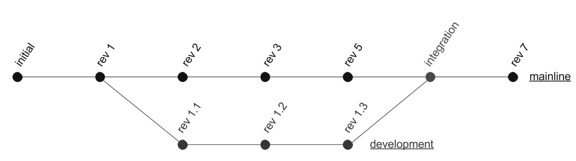

### Objetivo

Comparar as principais ferramentas e serviços disponíveis
para Integração Contínua, demonstrando que o uso da prática
quase não exige tempo ou esforço enquanto aumenta
consideravelmente a qualidade de software.

====

### Integração de software

É o processo de mesclar um ou mais linhas de desenvolvimento
a uma linha principal.

Note:
Antes de falar sobre integração contínua é
preciso esclarecer o que é Integração de
Software e que problemas ela causa.

====

 <!-- .element: class="no-border no-background" -->

Note:
O processo de integração geralmente, mas não
necessariamentem, se baseia no uso de
um VCS/SCM (CVS, Subversion, Git, etc).

Se resume a mesclar as diversas modificações
realizadas num software simultaneamente (ex: por diferentes
desenvolvedores).

====

### Riscos

- Modificações conflitantes
- Desestabilizar a linha principal
- Bugs/regressão
- Complexidade do processo de integração

Note:
Martin Fowler descreve em seu famoso artigo sobre
Integração Contínua de uma empresa em que acompanhou
um processo de integração que se estendia por meses,
enquanto que a equipe não tinha nenhuma ideia de
quanto tempo ainda iria levar.

Eu mesmo já trabalhei onde a integração era realizada
apenas em cada _release_ a cada 3 ou 4 meses.

O que, este caso, levava horas ou até dias e
quem o fazia nem sempre tinha conhecimento de quais
modificações estavam sendo integradas ou por quais
motivos.

====

> O processo de integração <u>não</u> deve ser tratado
> como um evento.
>
> -- Martin Fowler

Note:
Martin Fowler é _chefe cientista_ na
ThoughtWorks e referência internacional
em engenharia de software.

- continuous integration, agile, dependency
  injection
