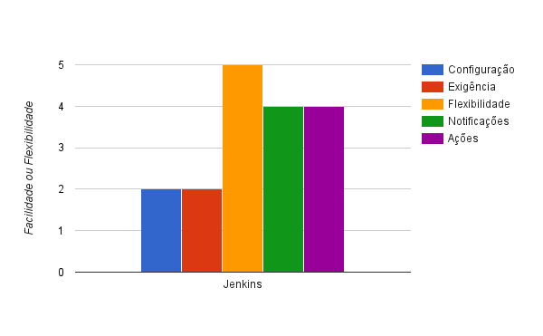

### Softwares e serviços analizados

- Cruise Control
- Jenkins server
- Atlassian Bamboo
- Codeship
- Drone.IO
- Circle CI
- Travis CI

====

### Metodologia

- Criadas suítes de testes em três diferentes linguagens
- Configurados softwares/serviços para executar as suítes
- Acompanhamento da execução dos testes
- Classificação segundo os quesitos

Note:
Foram utilizados testes simples em Ruby, Node.js e Elixir.

====

- Tempo de instalação e configuração
- Conhecimento específico necessário
- Flexibilidade e customização
- Facilidade de identificação de falhas
- Ações tomadas dependendo do resultado

Note:
Considerei os seguintes quesitos na avaliação.

====

Notas de 1 a 5, onde:

- **1:** Difícil, exigente, pouco útil ou com resultados imprecisos.
- **5:** Fácil, flexível ou com resultados práticos.

----

 <!-- .element: class="no-border no-background" -->

[cruisecontrol.sourceforge.net](http://cruisecontrol.sourceforge.net/)

Note:
Cruise Control foi o primeiro software criado
para automatizar CI, pela TW. O CC é inclusive
mencionado nos cases de Martin Fowler.

Hoje, a TW patrocina o desenvolvimento do Go
como alternativa ao Cruise Control e foco
em Entrega Contínua.

====


salesforce.com <!-- .element: class="credits" -->

Note:
Screenshot do Dashboard do CruiseControl

====

- Open source
- Instalado em servidor próprio
- Flexível, muito customizável
- Configuração via XML

Note:
Criado em 2001, pela ThoughWorks.
Licença BSD-Style.

====

Exemplo: _ANT Build file_

```xml
<!-- Delegating build script, used by cruisecontrol to build MY_PROJECT_1.
     Note that the basedir is set to the checked out project -->
<project name="build-MY_PROJECT_1"
        default="build"
        basedir="projects/MY_PROJECT_1">
    <target name="build">
        <!-- Get the latest from CVS -->
        <cvs command="up -d -P"/>
        <!-- Call the target that does everything -->
        <ant antfile="build.xml" target="build-everything"/>
    </target>
</project>
```

<small>`build-MY_PROJECT_1.xml`</small>

Note:
Cada projeto deve ter um ANT file como este exemplo.

====

Exemplo: Arquivo de configuração do Cruise Control

```xml
<cruisecontrol>
  <project name="MY_PROJECT_1" buildafterfailed="true">
    <listeners>
      <currentbuildstatuslistener
          file="logs/MY_PROJECT_1/status.txt"/>
    </listeners>

    <modificationset quietperiod="10">
      <cvs localworkingcopy="projects/MY_PROJECT_1"/>
    </modificationset>

    <schedule interval="60">
      <ant buildfile="build-MY_PROJECT_1.xml"
           uselogger="true"/>
    </schedule>

    <publishers>
    </publishers>
  </project>
</cruisecontrol>
```

<small>`config.xml`</small>

====

 <!-- .element: class="big" -->

----

 <!-- .element: class="no-border no-background" -->

[jenkins-ci.org](https://jenkins-ci.org/)

Note:
Solução mais popular, atualmente,
para integração contínua.

Jenkins é a solução mais versátil em
se tratando de CI e, possivelmente, a
mais fácil de se encontrar suporte ou
profissionais especializados.

====


faseau.top <!-- .element: class="credits" -->

Note:
Screenshot da lista de projetos em teste no
Jenkins.

====

- Open source
- Instalado em servidor próprio
- Flexível, muito customizável
- Configurado via _browser_

Note:
Possui 1083 plugins, incluindo _triggers_,
suporte à linguagens, etc.

====

Exemplo: Start Jenkins server

```console
JENKINS_VERSION=1.609.3
curl -fL http://mirrors.jenkins-ci.org/war-stable/$JENKINS_VERSION/jenkins.war\
  -o jenkins.war
java -jar jenkins.war
```

Note:
- baixa jenkins na versão edfinida
- executa com `java -jar`

====

 <!-- .element: class="big" -->

----

 <!-- .element: class="no-border no-background" -->

[atlassian.com/software/bamboo](https://www.atlassian.com/software/bamboo)

Note:
Pela mesma empresa do BitBucket.

O Bamboo parece uma solução muito robusta
e om ferramentas poderosas, especialmente
para _Deploy_ na AWS.

====

 <!-- .element: class="big" -->

atlassian.com <!-- .element: class="credits" -->

====

- Instalado em Amazon EC2 ou servidor próprio
- Flexível, muito customizável
- Muitas opções _post build_ / _deploy_
- Configurado via _browser_

====

 <!-- .element: class="big" -->

----

 <!-- .element: class="no-border no-background" -->

[codeship.com](https://codeship.com/)

 <!-- .element: class="no-border no-background" -->

[drone.io](https://drone.io/)

Note:
Dois dos mais simples e baratos serviços de CI
na nuvem.

Relativamente fáceis de configurar via browser.

====


Codeship

====


drone.io

====

- Integra com GitHub, BitBucket
- Integra com Google Code (drone.io, apenas)
- Configurado via _browser_

====

 <!-- .element: class="big" -->

----

 <!-- .element: class="no-border no-background" -->

[circleci.com](https://circleci.com/)

 <!-- .element: class="no-border no-background" -->

[travis-ci.org](https://travis-ci.org/)

[travis-ci.com](https://travis-ci.com/)

Note:
Circle CI e Travis CI são os meus favoritos,
especialmente por serem bastante fáceis de customizar
utilizando os arquivos de configuração e pela
integração co GitHub.

====


Circle CI

====


Travis CI

====

- Integra com GitHub
- Exibe notificações no GitHub
- Sem configuração para frameworks mais populares (CircleCI)
- Configurações específicas realizadas via arquivo (`circle.yml`, `.travis.yml`)

Note:
O `circle.yml`/`.travis.yml` deve ser adicionado ao repositório
do projeto.

====

```yml
dependencies:
  pre:
    - script/ci/prepare.sh
  cache_directories:
    - ~/dependencies
    - ~/.mix
    - _build
    - deps

test:
  override:
    - script/ci/test.sh
```

<small>`circle.yml`</small>

Note:
Configuração para rodar testes com Elixir,
uma linguagem não suportada oficialmente.

====

```yml
language: elixir
otp_release:
  - 17.4
```

<small>`.travis.yml`</small>

====

 <!-- .element: class="big" -->
