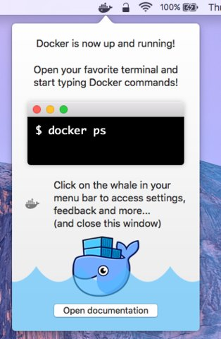
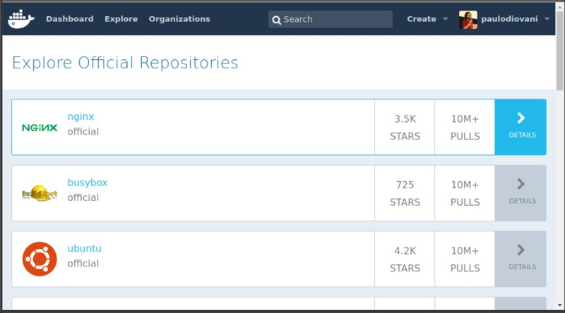
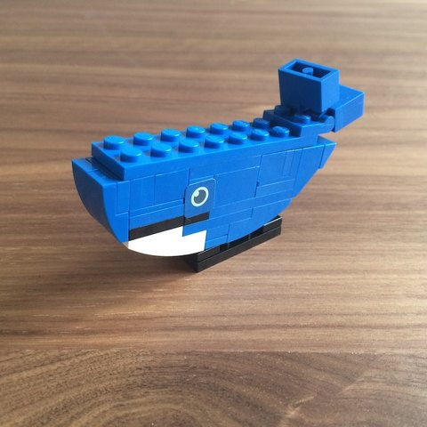
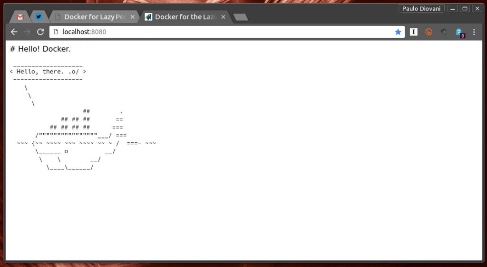
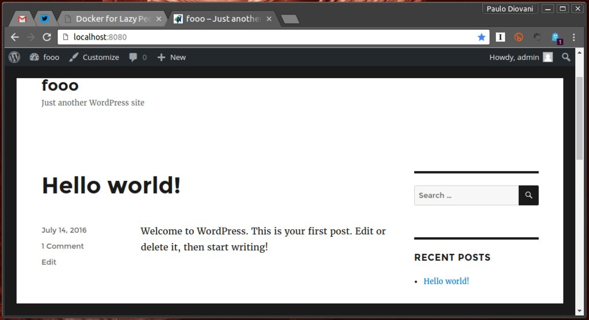

# Docker for Lazy People


https://www.flickr.com/photos/37060680@N04/4441496167 <!-- .element: class="credits" -->

Or how to use Docker to leverage dependency management and
reduce hard work

<small>Version 0.2.1</small>

Note:
We have cool whales for all over the talk. 🐋

====

`update 0.2.0` - Now with GIFs!


http://stefanieshank.tumblr.com/post/145720185704/orca-blog-insta <!-- .element: class="credits" -->

====

<!-- .slide: class="half-slide" data-background="url(img/paulodiovani.jpg)" data-background-size="contain" data-background-repeat="no-repeat" data-background-position="right" -->

### <i class="fa fa-user"></i> Paulo Diovani Gonçalves

Technologist in Internet Systems by Feevale University.
Software Enginer at Codeminer 42.
GNU/Linux user since 2005.

[blog.diovani.com][blog]

[slides.diovani.com][slides]

[@paulodiovani][twitter]

[![codeminer42][code-logo]][code-site] <!-- .element: class="no-border no-background" -->

[avatar]: img/avatar.jpg
[blog]: http://blog.diovani.com
[slides]: http://slides.diovani.com
[twitter]: http://twitter.com/paulodiovani
[code-logo]: img/codeminer42.png
[code-site]: http://codeminer42.com/

----

About being lazy...

> ## Finally fired after 6 years
>
> 
> https://www.engadget.com/2016/01/08/blade-runner-replicant-birthday/ <!-- .element: class="credits" -->

<small>_Archive: https://web.archive.org/web/20160523114950/https://www.reddit.com/r/cscareerquestions/comments/4km3yc/finally_fired_after_6_years/_ </small><!-- .element: class="more" -->
<br>
<small>~~_Original source: https://www.reddit.com/r/cscareerquestions/comments/4km3yc/finally_fired_after_6_years/_~~</small><!-- .element: class="more" -->

Note:
A programmer, as said on reddit, had 6 years
doing nothing after automatic some test tasks.

THIS TALK IS FOR LAZY PEOPLE WHO PREFER TO
AUTOMATE ITS'S TASKS.

Image: Roy Batty, from Blade Runner movie (1982)

====

**This is NOT a talk about _bots_ 🤖.** <!-- .element: class="big" -->

<span>For that, ask [@hannelita][htt]</span> <!-- .element: class="small" -->
![hannelita][hta]

[htt]: https://twitter.com/hannelita/
[hta]: img/hannelita.png

Note:
I'm not speaking about bots, but in automating
frequent or worksome tasks.

====

### Automation in Ruby ecosystem

- rspec tests
- migrations
- rake tasks

Note:
We are used to have automated tasks in ruby, already.

----

## Yet another talk about Docker

...not realy (or I hope so)

Note:
We have been having a lot of Docker talks recently.
Most of then a lot complicated.

...Giving us a lot of sample commands hard to remember.

====

> ## It's the Future
>
> 

<small>_Source: https://circleci.com/blog/its-the-future/_</small><!-- .element: class="more" -->

Note:
A fun post on circle-ci blog introduces Docker and containers
(and a lot more) as ~~an alternative~~ the new way for a simple
web hosting.

Thanks, Azzi.

====

### The Docker ecosystem

Docker official tools          | Third Parties
---                            | ---
Docker Engine                  | Kitematic
Docker Compose                 | Azk
Docker Hub                     | Kubernetes
Docker Cloud                   | Apache Mesos
Docker Trusted Registry        | CoreOS
Docker Universal Control Plane |
Docker Machine                 |
Docker Toolbox (old)           |

Note:
And we have so much more

====

> Too complex to me


https://infoslack.com/rubyconf2015/docker/#/13 <!-- .element: class="credits" -->

Note:
The gotcha is that, even with the full, amazing,
capabilities of Docker, one cannot handle all
the information and deal with advantages at once.

In the end, people just walk away from Docker. :'(

====

Docker

# Must be easier

for me to start using it

Note:
This talk introduces Docker in a way...

- Easy to use
- Easy to understand
- Able to solve problems

Goal: You'll be able to start using docker today,
with little or no impact on daily work

----

 <!-- .element: class="no-border no-background" -->

A little words about Docker and containers

Note:
But what is Docker, anyway?

I promise that this is a brief introduction.

====

## Software container

> Operating-system-level virtualization

&nbsp;

- Virtualization without hardware emulation
- Share the kernel with the host machine

Note:
a.k.a. Operating-system-level virtualization

It is a virtualization technique
that does not emulates hardware.

====

## Docker

> Build, Ship, and Run Any App, Anywhere

&nbsp;

- A plataform for working with _software containers_.

Note:
The Docker ~~description~~ title on the main
website.

...and a free spech descrition.

====

### Images vs. Containers

- A Docker **image** is a _read only_ layer that can
  be packaged and distributed.
- A Docker **container** is an instance of an image. it's
  a _writable_ layer used to run commands or store data.

Note:
Images remain exactly the same wherever environment
they are used.

This is a Docker itself terminology. Other container
plataforms may not consider that.

====


http://imgur.com/gallery/2qxNu2Z <!-- .element: class="credits" -->

Note:
Oh, so Docker is used in place of virtualbox or
vagrant? o.O

No! It's not.

====

_Docker is **not** about virtualization,_ <!-- .element: class="big" -->

_it is about **services**_ <!-- .element: class="big" -->

Note:
Notice that!

The tricky (and greatest) thing about Docker is
that it's made to run services, and not a full-fledged
environment.

----

## Before we start

====

## What do we need?

- Docker Engine
  + https://docker.com
- Docker Compose
  + https://docs.docker.com/compose/
- Docker Hub
  + https://hub.docker.com/

====

## Installation

- GNU/Linux
  + https://www.docker.com/products/docker#/linux
- Mac OSX
  + https://www.docker.com/products/docker#/mac
- MS Windows
  + https://www.docker.com/products/docker#/windows

====

### Arch Linux

```bash
$ sudo pacman -Sy docker docker-compose
```

Note:
The easiest distro to install Docker

====

### Mac and Windows

#### Before 1.12

- boot2docker (`until 1.7`)
  + using VirtualBox
- Docker Toolbox (`1.8 ~ 1.11`)
  + with Docker Machine
    * ...that still uses VirtualBox

Note:
Until version 1.11 Docker for Mac and Windows
was not as easy to use, depending on a Virtual Box
VM, environment variables and etc.

====


https://teespring.com/lifting-a-docker <!-- .element: class="credits" -->

Note:
It works well enough, but with lack
of performance and some other issues.

====

### Mac and Windows

- Docker for Mac (`since 1.12-rc2`)
  + requires Yosemite `10.10`
  + uses a `xhyve` based Hypervisor
- Docker for Windows (`since 1.12-rc2`)
  + requires Window `10 64bit`
  + uses `Hyper-V`

Note:
Recenty, with 1.12, Docker uses a native client
and native Hypervisors.

It's already considered stable version.

====



https://blog.docker.com/2016/03/docker-for-mac-windows-beta/ <!-- .element: class="credits" -->

Note:
This improves docker under Mac and Windows
a lot.

====



https://hub.docker.com/

Note:
Docker Hub

----

## Managing dependencies

## should be easy

Note:
Lets stick with the main topic now!

====
<!-- .slide: data-transition="slide-in fate-out" -->

### Potential application

- Ruby on Rails app
- PostgreSQL Database <!-- .element: class="fragment fade-up" -->
- Redis for Sidekick Worker <!-- .element: class="fragment fade-up" -->
- Elasticsearch for full-text searches <!-- .element: class="fragment fade-up" -->

| &nbsp;
| ---
| &nbsp;
| &nbsp;
<!-- .element: style="visibility: hidden;" -->

Note:
Lets consider this potential, very common,
appication.

====
<!-- .slide: data-transition="fade" -->

### Potential application

- Ruby on Rails app <!-- .element: class="red" -->
- PostgreSQL Database
- Redis for Sidekick Worker
- Elasticsearch for full-text searches

| &nbsp;
| ---
| Application code, business logic, etc. <!-- .element: class="red" -->
| &nbsp; <!-- .element: class="hidden" -->

Note:
What is realy important for me when I'm developing?

====
<!-- .slide: data-transition="fade" -->

### Potential application

- Ruby on Rails app <!-- .element: class="red" -->
- PostgreSQL Database <!-- .element: class="blue" -->
- Redis for Sidekick Worker <!-- .element: class="blue" -->
- Elasticsearch for full-text searches <!-- .element: class="blue" -->

| &nbsp;
| ---
| Application code, business logic, etc. <!-- .element: class="red" -->
| Volatile data <!-- .element: class="blue" -->

Note:
The only layer I'm always working on is the
app code itself. Everything else I just don't
bother on configuring.

====
<!-- .slide: data-transition="fade-in slide-out" -->

### Potential application

- Ruby on Rails app <!-- .element: class="red" -->
- PostgreSQL Database <!-- .element: class="blue" -->
- Redis for Sidekick Worker <!-- .element: class="blue" -->
- Elasticsearch for full-text searches <!-- .element: class="blue" -->

| &nbsp;
| ---
| On host machine <!-- .element: class="red" -->
| On docker containers <!-- .element: class="blue" -->

Note:
So, I could have only the Rails app on my machine
and let everything else on containers.

====

### Do not install

...what you won't actively use

- Cache stores
- CI Services
- Compilers
- Databases
- HTTP Servers
- Interpreters
- Libraries
- Load Balancer
- Proxy Servers

Note:
The idea is to NOT install what you doesn't have
to change/configure/edit frequently.

====

### Why not?

- difficult to install
- version restrictions
- waste of system resources
- **waste of time**

Note:
Development dependencies are usually hard to install
and configure. And they heavy a lot on the machine.

====

### How?



https://blog.travis-ci.com/2014-12-17-faster-builds-with-container-based-infrastructure/ <!-- .element: class="credits" -->

----

## Docker compose

> Defining and running multi-container Docker applications.

Note:
For now on, we'll be using Docker compose

====

### Orchestration

> The automated arrangement, coordination, and management of complex computer systems, middleware and services.

<small>*Source: https://en.wikipedia.org/wiki/Orchestration_(computing)*</small> <!-- .element: class="more" -->

Note:
Compose basicly does service orchestration.

====

### The <b class="lowercase">docker-compose.yml</b> file

`docker-compose.yml`

- Define services
- Restrict networks
- Mount volumes
- Forward ports

It can (and must) be versioned alongside code.

Note:
Everything is set up using a YAML config file.

====

### Using Docker Compose

- `docker-compose up`
  + create/run containers <!-- .element: class="small" -->
- `docker-compose start|stop`
  + start or stop exiting containers <!-- .element: class="small" -->
- `docker-compose rm`
  + remove containers <!-- .element: class="small" -->
- `docker-compose ps`
  + check containers <!-- .element: class="small" -->
- `docker-compose logs`
  + read output logs <!-- .element: class="small" -->

Note:
...with small bunch of commands.

----

# Demo time


https://drawception.com/panel/drawing/ux1y3336/hovering-jellybean-devilwhale-is-happy/ <!-- .element: class="credits" -->

Note:
Learning by example.

----

## Example application 1

~~Ruby on Rails~~ + PostgreSQL + Redis + ElasticSearch

Note:
Let's use our potential application services.

====

Running **only dependencies** on Docker

Note:
In this example, we'll ignore the app and
just deal with dependencies.

====

```yml
version: '2'

services:
  db:
    image: postgres
    environment:
      POSTGRES_DB: lazy_people
    ports: ["5432:5432"]

  redis:
    image: redis
    ports: ["6379:6379"]

  search:
    image: elasticsearch
    ports: ["9200:9200", "9300:9300"]
```

====

<iframe data-autoplay src="https://asciinema.org/api/asciicasts/79790?size=big" id="asciicast-iframe-79790" name="asciicast-iframe-79790" scrolling="yes" width="100%" height="768"></iframe>

Note:
Files at `./demos/databases`

====

> That was fun. :)

 <!-- .element: class="wide" -->
http://giphy.com <!-- .element: class="credits" -->

----

## Example application 2

Static site on Nginx

Note:
A simple, static website (actualy only a page)
running on nginx

====

Running the **HTTP server** on Docker

====

```yml
version: '2'

services:
  web:
    image: nginx
    ports:
      - "8080:80"
    volumes:
      - "./:/usr/share/nginx/html:ro"
```

====

<iframe data-autoplay src="https://asciinema.org/api/asciicasts/79581?size=big" id="asciicast-iframe-79581" name="asciicast-iframe-79581" scrolling="yes" width="100%" height="768"></iframe>

Note:
Files at `./demos/static`

====



====

> Yuppie! :D

 <!-- .element: class="stretch" -->
http://giphy.com <!-- .element: class="credits" -->

----

## Example application 3

Node.js + Express

Note:
A simple http server with node.js

====

Running a Node.js application on Docker

Note:
Since Node.js store dependencies on `node_modules/`
It's easy to run almost any app on Docker

====

```yml
version: '2'

services:
  web:
    image: node
    command: ["npm", "start"]
    working_dir: /usr/src/app
    volumes:
      - "./:/usr/src/app"
    ports:
      - "8080:8080"
```

Note:
In this example, we had to set workdir and
a command (particularity of this image)

====

<iframe data-autoplay src="https://asciinema.org/api/asciicasts/79789?size=big" id="asciicast-iframe-79789" name="asciicast-iframe-79789" scrolling="yes" width="100%" height="768"></iframe>

Note:
Files at `./demos/express`

====

> Easy, right? ;)

 <!-- .element: class="stretch" -->
http://giphy.com <!-- .element: class="credits" -->

----

## Example application 4

PHP + ~~Wordpress~~ + MySQL

Note:
Running Wordpress on a PHP container

====

- PHP interpreter on Docker
- MySQL database on Docker

Note:
Notice that I DON'T have PHP installed on host

====

```yml
version: '2'

services:
  web:
    build: ./
    depends_on: ["db"]
    ports: ["8080:80"]
    volumes: ["./:/var/www/html"]

  db:
    image: mysql
    environment:
      MYSQL_DATABASE: wordpress
      MYSQL_ROOT_PASSWORD: root
```

Note:
- Notice the `build` key on web service.
- Notice the `depends_on` and `db` service name.
  It'll be the hostname.

====

```dockerfile
FROM php:apache

# Install dependencies
RUN apt-get update && apt-get install -y \
    mysql-client

# Add php extension
RUN docker-php-ext-install mysqli pdo pdo_mysql
```

Note:
For this example, we need a Dockerfile.

The Dockerfile only install some needed
dependencies (mysql ext in the case).

====

<iframe data-autoplay src="https://asciinema.org/api/asciicasts/79590?size=big" id="asciicast-iframe-79590" name="asciicast-iframe-79590" scrolling="yes" width="100%" height="768"></iframe>

Note:
Files at `./demos/worpress`

On this cast, I only show the build and startup
process.

I wrote a wp-config.php before wp setup to save time.

====



Note:
After the services start, the app is available
on port 8080 as before.

====

> Amazing! :o

<!-- .element: class="stretch" -->
http://giphy.com <!-- .element: class="credits" -->

----

# Conclusion

With Docker, software dependencies may be...

- Easy to setup and manage
- Started with a single command
- Always on correct versions
- and without touching the _Host_

====

 <!-- .element: class="stretch" -->
http://giphy.com <!-- .element: class="credits" -->

====

 <!-- .element: class="no-border no-background" -->

# Q**uestions?** <!-- .element: class="lowercase" -->

====

## Bibliografy

- https://docker.com
- https://docs.docker.com
- https://blog.docker.com
- https://www.youtube.com/watch?v=SK0sqfVn7ls

====

### Credits

by Paulo Diovani Gonçalves

<small>[paulo@diovani.com]((mailto:paulo@diovani.com)</small>

_powered by: [reveal.js](http://lab.hakim.se/reveal-js/)_

<small>[http://lab.hakim.se/reveal-js/](http://lab.hakim.se/reveal-js/)</small>

<a rel="license" href="http://creativecommons.org/licenses/by-nc-sa/4.0/"></a>
<span xmlns:dct="http://purl.org/dc/terms/" property="dct:title">Docker for Lazy People</span> by <a xmlns:cc="http://creativecommons.org/ns#" href="http://diovani.com" property="cc:attributionName" rel="cc:attributionURL">Paulo Diovani</a> is licensed under a <a rel="license" href="http://creativecommons.org/licenses/by-nc-sa/4.0/">Creative Commons Attribution-NonCommercial-ShareAlike 4.0 International License</a>.
