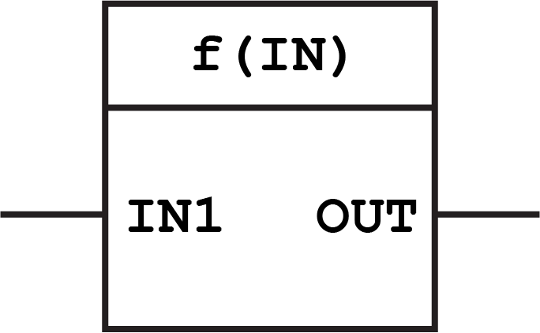
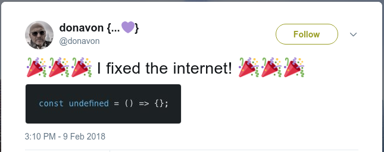

<!-- .slide: data-background="img/baby-steps.png" data-background-opacity=".4" data-background-size="contain" -->

## Functional Programming<br>baby steps<br>with JavaScript

<small>Version 0.1.0</small>

<small>by Paulo Diovani</small>

Note:
Meu propósito dessa palestra é dar uma intridução bem básica
de FP, sem me aprofundar nos conceitos, assim como alguns
exemplos de utilização em JavaScript que possam ajudar a
escrever códigos melhores.

- Quem já programa ou conhece FP?

----
<!-- .slide: data-background="img/functional-programming-word-cloud.png" data-background-size="contain" -->

Note:
Ao pesquisar sobre FP geralmente nos deparamos com uma série desses
conceitos e fica bem difícil absorver tudo ou entender os alicerces
do paradigma.

Vou falar de alguns desses conceitos adiante, mas não todos.

====
<!-- .slide: id="fp-definition" class="bigtext" -->

**Functional Programming**

is a _programming paradigm_ that

treats computation as the evaluation of mathematical functions and

avoids changing-state and mutable data

Note:
FP é um paradigma, assim como OOP que basicamente se resume a
aplicar funções matemáticas a valores.

Talvez a principal característica deste paradgima é que ele evita
a mudança de estado e mutabilidade dos dados.

====

Mutable data

```
const zoo = [ '🐍', '🦓', '🐻', '🐕', '🦇', '🐇' ]
zoo.sort()
// [ '🐇', '🐍', '🐕', '🐻', '🦇', '🦓' ]
zoo
// [ '🐇', '🐍', '🐕', '🐻', '🦇', '🦓' ]
```

Immutable data

```
const zoo = [ '🐍', '🦓', '🐻', '🐕', '🦇', '🐇' ]
sort(zoo)
// [ '🐇', '🐍', '🐕', '🐻', '🦇', '🦓' ]
zoo
// [ '🐍', '🦓', '🐻', '🐕', '🦇', '🐇' ]
```

Note:
Para ilustrar um pouco mutabilidade ou imutabilidade, note
a aplicação da função `sort()` nesses arrays.

A primeira muda o array, enquanto a segunta apenas retorna
um novo, deixando os valores originais intactos.

====

 <!-- .element: class="no-border" -->

Note:
Em FP não é muito comum escrever diagramas como para classes (em UML),
mas a representação de uma função seria mais ou menos assim:

Há um valor (ou mais de um) de entrada e um único de saída, e a
função faz computações para alterar ou transformar a entrada na
saída.

Sempre sem alterar o valor original.

----
<!-- .slide: id="js-definition" class="bigtext" -->

**JavaScript**

is a high-level, interpreted programming language which is also characterized

as dynamic, weakly typed, prototype-based and multi-paradigm

Note:
Mas entrando no tópico principal, que é JavaScript...

JS é uma linguagem multi-paradigma. O que significa que podemos programar
usando OOP, FP, etc. A linguagem é inclusive comumente usada para exemplos
de FP.

- Quem programa em, ou conhece JavaScript aqui?

====

```
🔴 Uncaught TypeError: undefined is not a function
```

Note:
Mas como todos sabemos, JS tem seus problemas.

- Quem nunca viu esse erro? (questão retórica)

====

## Solving JS problems with<br>Functional Programming

 <!-- .element: class="no-border" -->

<small>https://github.com/donavon/undefined-is-a-function</small>

Note:
Então como a gente pode usar FP para resolver alguns problemas comuns
em JavaScript?

- _Não precisa, o @donavon já resolveu._ 👏

----

### 1. Avoid side effects

```
const family = ['👨', '👩', '👦']

function haveAnAffair() {
  return family.push('👶')
}

haveAnAffair()
family
// ['👨', '👩', '👦', '👶']
```
<small>Hey, that baby isn't mine? 😕</small>

Note:
Side-effects é quando uma função causa mudanças de estado fora
do escopo da mesma.

No exemplo, a função `haveAnAffair()` adiciona um elemento ao
array declarado fora dela.

====

### ~~1. Avoid side effects~~ ✔

```
const family = ['👨', '👩', '👦']

function haveAnAffair(people) {
  return people.concat('👶')
}

haveAnAffair(family)
family
// ['👨', '👩', '👦']
```

<small>A function is pure if the return value is only determined by its input values, and does not produce side effects.</small>

Note:
A solução é usar funções _puras_.

Uma função pura é uma cujo valor de retorno é determinado apenas pelos
seus argumentos e não produz side-effects.

Isso pode ser feito de várias maneiras. A mais simples é sempre passar
todos os dados que a função precisa como argumentos.

====

### 2. Enforce immutability

```
const myFarm = { cow: '🐄', sheep: '🐑' }

function abduct(animals) {
  animals.cow = '👽'
}

abduct(myFarm)
myFarm
// { cow: '👽', sheep: '🐑' }
```

<small>Who turned my cow into an alien? 😱</small>

Note:
Imutabilidade pode ser difícil de garantir porque a linguagem
passa tudo por referência ao invés de fazer cópias.

No exemplo a minha _vaca_ é trocada por aliens pela função.

Note que mesmo passar como argumento não é suficiente para resolver.

_Um caso de um cliente, recentemente..._

====

### ~~2. Enforce immutability~~ ✔

```
const myFarm = { cow: '🐄', sheep: '🐑' }
Object.freeze(myFarm)

function abduct({...animals}) {
  animals.cow = '👽'
}

abduct(myFarm)
myFarm
// { cow: '🐄', sheep: '🐑' }
```

<small>An immutable object is an object whose state cannot be modified after it is created.</small>

Note:
Para garantir a imutabilidade você pode:

- usar `Object.freeze()` (só funciona no primeiro nível)
- clonar o objeto (com spread por exemplo, que falareu mais adiante)
- usar alguma biblioteca

No exemplo estou tanto usando `freeze` como clonando o objeto.

----

### 3. Use map/reduce for list transformations

```
const vegetables = ['🥒', '🥦', '🍅', '🥕']

function makeSalad(ingredients) {
  for (let i = 0; i < ingredients.length; i++) {
    ingredients[i] = slice(ingredients[i])
  }
  return mix(ingredients)
}

makeSalad(vegetables)
// 🥗
```

Note:
Loops podem ficar confusos, especialmente se houverem muitas
operações dentro do laço.

- considerem que `slice` e `mix` são métodos declarados anteriormente
  e que se aplicam a um único elemento.

====

### ~~3. Use map/reduce for list transformations~~ ✔

```
const vegetables = ['🥒', '🥦', '🍅', '🥕']

function makeSalad(ingredients) {
  return ingredients
    .map(slice)
    .reduce(mix)
}

makeSalad(vegetables)
// 🥗
```

<small>High Order Functions (HOF) are functions which takes a function as an argument and/or returns a function.</small>

Note:
`map` e `reduce` são funções que podem substituir loops
e deixar o código muito mais limpo e legível.

- `map` aplica uma função, no exemplo `slice`, a cada elemento da lista
- `reduce` reduz a lista a único elemento com uma função de combinação

Ambas são também HOF, que são funções que recebem funções como argumentos
ou retornam funções. Algo muito comum em FP.

====

### 4. Keep your functions short

```
function reserveRestaurantPaySendReceiptForRefund() {
  //...
}

function handleLunch() {
  //...
}
```

<small>"A function with _handle_ in the name probably does a lot of stuff." -- @silveira_bells</small>

Note:
Outra desafio comum é manter funções pequenas. Como a Isabela disse
na sua talk do BrazilJS, _se tem handle no nome é um mal sinal..._

- Se você tem uma função que passa de 10 linhas você já tem ponto
de melhoria. Se tem mais de 50 você já tem um problema.

====

### ~~4. Keep your functions short~~ ✔

```
const compose = (f1, f2, f3, f4) => (a) =>
  f1(f2(f3(f4(a))))

compose(
  waitForRefund,
  sendReceip,
  payLunch,
  reserveRestaurant
)('🍽')
```

<small>Composition is the act of putting functions together to form a function where the output of one function is the input of the other.</small>

Note:
Uma forma muito eficiente de quebrar funções grandes é por composição,
que é a pratica de unir funções para criar novas funções.

A função `compose` aceita funções como argumentos e retorna uma nova
função que aplica todas as outras da direita para esquerda.

- `pipe` faz o mesmo, mas aplica da esquerda para direita.

----

### 5. Allow partial application

```
function driveUber(car, fuel, passenger) {
  return '🛣'
}

driveUber('🚙', '⛽')
// TypeError ...
driveUber(null, null, '🧑')
// TypeError ...
driveUber('🚙', '⛽', '👪')
// 🛣
```

<small>Do I need to buy a new car and fill up for each ride? 💸</small>

Note:
E também funções com muitos argumentos, especialmente quando alguns
deles não estão disponíveis ao mesmo tempo.

No exemplo. Se eu sou um motorista de Uber eu preciso de um carro,
de combustível e de passageiros. Mas o carro e combustível estão
disponíveis muito antes dos passageiros.

Para dar um exemplo mais prático. Se eu tenho uma função que faz
requisições de API, eu conheço o endpoint muito antes de ter acesso
aos dados a enviar.

====

### ~~5. Allow partial application~~ ✔

```
const driveUber = (car) => (fuel) => (passenger) => {
  return '🛣'
}

const fillUp = driveUber('🚙')
// [Function]
const giveRide = fillUp('⛽')
// [Function]
giveRide('🧑')
// 🛣
giveRide('👪')
// 🛣
```

<small>Currying is the process of converting a function that takes multiple arguments into a function that takes them one at a time.</small>

Note:
_Partial Application_ e _Currying_ são processos de invocar a função
previamente apenas com os argumentos que já estão disponíveis, gerando
uma nova função.

No exemplo, eu crio novas funções que já incluem o carro e combustível
e só preciso do passageiro posteriormente.

====

#### ⚠ JavaScript mutator methods

`copyWithin()` `fill()` `pop()` `push()` `reverse()` `shift()` `sort()` `splice()` `unshift()`

`Object.assign()`

#### JavaScript acessor methods

`concat()` `includes()` `indexOf()` `join()` `lastIndexOf()` `slice()` `toSource()` `toString()` `toLocaleString()`

Note:
Bem, este foi um resumo de alguns conceitos de FP e como aplicá-los
para resolver problemas. E JS já possui muitos métodos para ajudar
nisso.

Muito cuidado porém com _mutator methods_ (que mudam o estado). Minha
sygestão é que os evitem. Prefiram criar suas próprias versões desses
métodos, que não alterem estado, ou usem libs de terceiros.

- No slide uma lista de _mutator methods_ e _acessor methods_

----

## JS Vanilla Syntax for ES2015 and Beyond

 <!-- .element: class="no-border no-bg half-width" -->

<small>Babel or Babel.js is a free and open-source JavaScript compiler and configurable transpiler used in web development.</small>

Note:
JS vem evoluindo rapidamente nos últimos anos e várias novas
features estão muito mais sucetíveis a FP, facilitando o trabalho.

Felizmente temos também Babel.js que possibilidade a escrita de código
mais modernos sem (muita) preocupação com compatibilidade.

====

### Destructuring assignment

```
[a, b, ...rest] = ['♠', '♥', '♦', '♣'];
a // '♠'
b // '♥'
rest // ['♦', '♣']

{a, b, ...rest} = {a: '♠', b: '♥', c: '♦', d: '♣'};
a // '♠'
b // '♥'
rest // {c: '♦', d: '♣'}
```

Note:
_Destructuring Assigment_ é um exemplo que permite a obtenção
de elementos de arrays e objetos sem necessidade de iterações
ou risco de alteração imprevista.

====

### Destructuring assignment for function arguments

```
function getRedSuits({ b, c }) {
  return { b, c }
}

const suits = {a: '♠', b: '♥', c: '♦', d: '♣'}

getRedSuits(suits)
// {b: '♥', c: '♦'}
```

Note:
Eles também podem ser usados diretamente como argumentos
de funções dando acesso à função apenas ao que precisa.

====

### Spread operator

```
const dateFields = [1970, 0, 1];  // 1 Jan 1970
new Date(...dateFields);

const birds = ['🕊', '🐦', '🐧'];
const rodents = ['🐀', '🐇'];
const animals = [...birds, ...rodents, '🚶']
// ['🕊', '🐦', '🐧', '🐀', '🐇', '🚶'];

const obj1 = { deepthought: '🤖', answer: 42 };
const clonedObj = { ...obj1 };
// Object { deepthought: '🤖', answer: 42 }
```

Note:
O _spread operator_, que cheguei a usar em alguns exemplos anteriormente
é uma _mão na roda_ para atribuições, concatenação, clonagem de objetos, etc.

Spread também pode ser usado para argumentos de funções, substituindo
o método `apply` -- basicamente, transforma arrays em argumentos.

----

## JS Functional Programming Libraries

- [Functional.js](http://functionaljs.com/)
- [Lodash/FP](https://github.com/lodash/lodash/wiki/FP-Guide)
- [Ramda](https://ramdajs.com/)
- [Immutable](http://facebook.github.io/immutable-js/)
- ...

Note:
Para quando o disponível no Vanilla JS não for suficiente (ou apenas
para deixar as coisas mais fáceis e/ou legíveis) existem várias
bibliotecas JS voltadas para FP.

Eu sempre recomendo o Ramda. Que na minha opinião é a mais completa e
estável. Lodash tem uma extensão para FP, para quem está acostumado a ele.

O Immutable.js garante que seus dados sejam SEMPRE imutáveis, mas ele
define tipos próprios, o que pode ser uma dor de cabeça em alguns casos
(converter de/para tipos nativos, por exemplo).

====

## FP Languages which compiles to JavaScript

- [elm](http://elm-lang.org/)
- [ClojureScript](https://clojurescript.org/)
- ...

Note:
E também existem linguagems puramente FP que compilam para JS.

Estas são as mais conhecidas, mas também existem outras,
inclusive para Erlang/Elixir.

====

## Conclusions

- Use FP to solve problems
- Mix paradigms
- Apply design patterns
- Test your code
- Learn other languages

Note:
Por fim, a maior dica aqui é:

- Aprendam uma linguagem FP que só isso já vai ajudar a resolver
  problemas de maneiras diferentes.
  
----
<!-- .slide: class="references" -->

## References

- https://github.com/hemanth/functional-programming-jargon
- https://blog.codeminer42.com/introduction-to-functional-programming-with-javascript-c06a2540a7c3
- http://slides.diovani.com/slides-flatenning-js-modules/index.html
- https://en.wikipedia.org/wiki/Functional_programming
- http://recurship.com/blog/immutable-data-structures-functional-javascript
- https://www.plcacademy.com/function-block-diagram-programming/
- https://mikhail.io/2018/07/monads-explained-in-csharp-again/
- https://developer.mozilla.org

====

![avatar][avatar] <!-- .element: class="avatar" -->

### Paulo Diovani Gonçalves

Technologist in Internet Systems by Feevale University.
Software Enginer at Codeminer 42.
GNU/Linux user since 2005.
<!-- .element: class="bio" -->

<table>
  <tr>
    <td>[medium/@paulodiovani][medium]</td>
    <td>[blog.diovani.com][blog]</td></tr>
  <tr>
    <td>[slides.diovani.com][slides]</td>
    <td>[@paulodiovani][twitter]</td>
  </tr>
  <tr>
    <td colspan="2" class="align-center">
      [![codeminer42][code-logo]][code-site] <!-- .element: class="no-border no-background" -->
    </td>
  </tr>
</table>

[avatar]: img/avatar.jpg
[medium]: http://medium.com/@paulodiovani
[blog]: http://blog.diovani.com
[slides]: http://slides.diovani.com
[twitter]: http://twitter.com/paulodiovani
[code-logo]: img/codeminer42.png
[code-site]: http://codeminer42.com/
