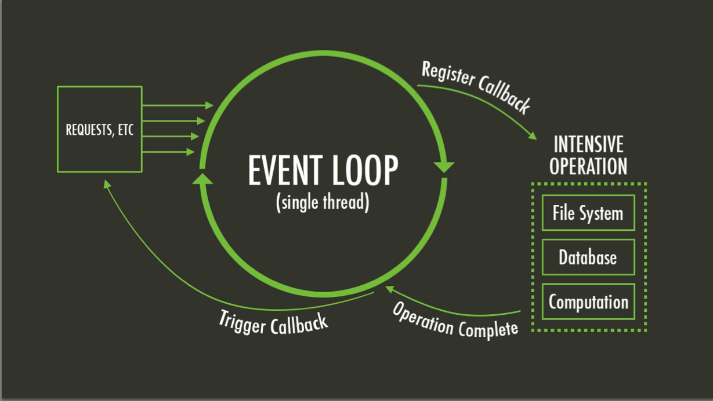
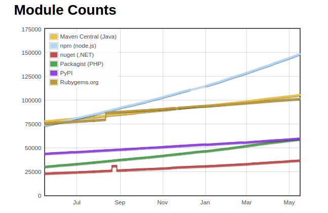
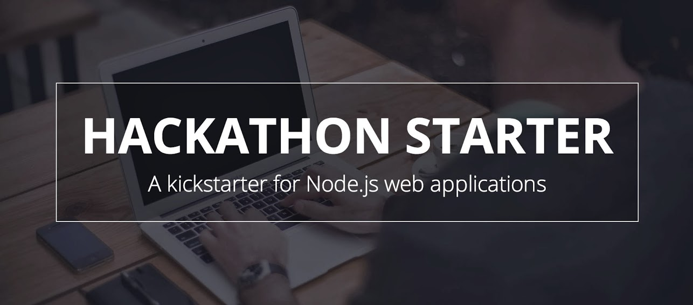

### Um simples servidor web

```javascript
var http = require('http');

http.createServer(function (req, res) {
  res.writeHead(200, {'Content-Type': 'text/plain'});
  res.end('Hello World\n');
}).listen(1337, '127.0.0.1');

console.log('Server running at http://127.0.0.1:1337/');
```

#### Rodando o webserver

```
$ node example.js
Server running at http://127.0.0.1:1337/
```

Note:
Criando um webserver em 30 segundos

====

> Javascript (JS) é uma linguagem de programação usada
> primeiramente por _web browsers_ para permitir conteúdo
> dinâmico em páginas web.
>
> Ela pode também ser utilizada
> no servidor para qualquer tipo de ações.

Fonte: <!-- .element: class="reference" -->
[MDN](https://developer.mozilla.org/en-US/docs/Glossary/JavaScript)

Note:
Reparem que é escrito em Javascript.
"Mas javascript é para browsers?"

Definição de Javascript no glossáro da MDN (Mozilla Developer Network)

====

### Javascript no servidor não é novidade

* 4D Wakanda
* APE project
* [Aptana Jaxer](https://github.com/aptana/Jaxer)
* Narwhal
* [Node.js](http://nodejs.org)
    * Joyent NodeJS
* [Rhino Javascript engine](https://developer.mozilla.org/en-US/docs/Mozilla/Projects/Rhino)
    * Sitepoint Persevere
    * RingoJS

Fonte: <!-- .element: class="reference" -->
[stackoverflow](http://stackoverflow.com/questions/1992367/best-server-side-javascript-servers)

Note:
Node.js não é a primeira, tampouco a única, solução para utilizar Javascript no servidor.

====

Node.js permite escrever aplicações _server side_ com Javascript, incluindo...

* Aplicações web _realtime_
* Webservice APIs
* Aplicações em linha de comando
* Aplicações desktop (com widgets, CURSES, HTML, etc.)

Note:
Uma explicação livre de Node.js

====

### Por que Node.js?

- Rápido e escalável
- Para APIs, mobile, web e IoT
- Baixa curva de aprendizagem
- Comunidade crescente e participativa
- Javascript é a linguagem mais popular atualmente
  ([GitHut](http://githut.info/))

====

### Quem usa Node.js?


Fonte: <!-- .element: class="reference" -->
[strongloop](https://strongloop.com/node-js/why-node/)

Note:
Algumas pequenas empresas que usam node.js

----

 <!-- .element: class="no-border no-background" -->
 <!-- .element: class="no-border no-background" -->

> ##### LinkedIn muda de Rails para Node: 27 servidores cortados e até 20x mais rápido.

Fonte: <!-- .element: class="reference" -->
[highscalability][linkedin-to-node]

<small>Obs: existem alguns [fatos não mencionados][some-facts]
no artigo original.</small>

[linkedin-to-node]: http://highscalability.com/blog/2012/10/4/linkedin-moved-from-rails-to-node-27-servers-cut-and-up-to-2.html
[some-facts]: http://ikaisays.com/2012/10/04/clearing-up-some-things-about-linkedin-mobiles-move-from-rails-to-node-js/

====

 <!-- .element: class="no-border no-background" -->
 <!-- .element: class="no-border no-background" -->

> ##### Como o LinkedIn usou Node.js e HTML5 para construir uma app melhor e mais rápida

Fonte: <!-- .element: class="reference" -->
[venturebeat][linkedin-to-node-2]

[linkedin-to-node-2]: http://venturebeat.com/2011/08/16/linkedin-node/

====

 <!-- .element: class="no-border no-background" -->
 <!-- .element: class="no-border no-background" -->

> ##### PayPal muda de Java para Javascript
>
> |                  | Java/Spring      | Node.js                 |
> | --               | --               | --                      |
> | Preparação       | 0                | 2 meses                 |
> | Desenvolvimento  | ~5 meses         | ~3 meses                |
> | Equipe           | 5                | 5                       |
> | Linhas de código | não especificado | 66% de não especificado |

Fonte: <!-- .element: class="reference" -->
[infohq][paypal-to-node]

[paypal-to-node]: http://www.infoq.com/news/2013/11/paypal-java-javascript

====

 <!-- .element: class="no-border no-background" -->
 <!-- .element: class="no-border no-background" -->

> ##### Node.js no PayPal
>
> - Construído quase 2x mais rápido com menos pessoas
> - 33% menos linhas de código
> - 40% menos arquivos
> - Dobradas as requisições por segundo
> - Queda de média de 35% no tempo de resposta

Fonte: <!-- .element: class="reference" -->
[paypal-enginering][paypal-to-node-2]

[paypal-to-node-2]: https://www.paypal-engineering.com/2013/11/22/node-js-at-paypal/

====

 <!-- .element: class="no-border no-background" -->
 <!-- .element: class="no-border no-background" -->

> ##### Por que Wallmart está usando Node.js?
>
> [...] Executivos do Wallmart deixaram claro que o benefício
> em usar Node.js era, de longe, maior que o risco [...]

Fonte: <!-- .element: class="reference" -->
[venturebeat][wallmart-in-node]

[wallmart-in-node]: http://venturebeat.com/2012/01/24/why-walmart-is-using-node-js/

====

 <!-- .element: class="no-border no-background" -->
 <!-- .element: class="no-border no-background" -->

> ##### Node.js em chamas
>
> [...] notamos que a latência de requisições para a aplicação
> em Node.js aumentava à medida do tempo [...]

<small>Culpa do Express?</small><br>
<small>[Resposta por hueniverse no GitHub.][answer-on-flames]</small>

Fonte: <!-- .element: class="reference" -->
[netflix techblog][netflix-node-on-fire]

[netflix-node-on-fire]: http://techblog.netflix.com/2014/11/nodejs-in-flames.html
[answer-on-flames]: https://gist.github.com/hueniverse/a3109f716bf25718ba0e

----

> Node.js é uma plataforma construída sobre o
> [_Motor Javascript do Chrome_](http://code.google.com/p/v8/) para criar
> aplicações em rede rápidas e escaláveis.
>
> Node.js usa um modelo de _I/O_ não bloqueante, orientado a eventos,
> que o torna leve e eficiente, perfeito para aplicações em tempo
> real com grande tráfego de dados que rodam através de dispositivos
> distribuídos.

Fonte: <!-- .element: class="reference" -->
[nodejs.org](http://nodejs.org/)

Note:
Definição do Node.js no site oficial.

====

### Node.js não é uma nova linguagem

<small>Escrito em Javascript</small>

Note:
Apesar de ser essencialmente Javascript, Node.js possui um ecosistema
próprio e sua própria forma de programar.

====

### Node.js não é um framework

Note:
Ao contrário, existem diversos frameworks escritos
para Node.js

----

### _Single threaded_

Node.js foi desenvolvido para utilizar uma única _thread_.

Esta única _thread_ recebe e trata de todas as operações da aplicação.

Note:
Ou seja, um único processo.

Pergunta: Então essas operações ficam em fila?

====

#### _Non-blocking I/O_

Cada nova operação não precisa esperar que as anteriores
sejam completadas. Todas são processadas de forma assíncrona.

====



Fonte: <!-- .element: class="reference" -->
[stackoverflow](http://stackoverflow.com/q/21596172/1712589)

----

### Node _callbacks_

Ao se realizar uma operação de IO, passamos uma função de _callback_
para a mesma.

O _callback_ é executado ao final da operação, enquanto outras operações
são executadas em paralelo.

Note:
Muito semelhante ao uso de AJAX em Javascript.

====

Um _node callback_ recebe um objeto de erro como primeiro argumento
e um ou mais argumentos a seguir, contendo o resultado da operação.

```javascript
function myNodeCallback(err, data) {
  if (err) {
    //something went wrong
    return;
  }
  //normal flow
}
```

====

```javascript
var fs = require('fs');

fs.readFile('./example.txt', function(err, content) {
  if (err) console.error("Ocorreu um erro ao ler o arquivo");

  console.log(content.toString());
});
```

Note:
Exemplo de uso de um callback node.js.

----

### _Event driven_

Muitos objetos em Node.js emitem eventos.

- `net.Server` emite `"connection"` a cada vez que um cliente conecta.
- `fs.readStream` emite `"open"` quando o arquivo é aberto.

Note:
Este comportamento se assemelha muito a cliques e outras
ações do usuário em _web browsers_.

====

Adicionando _listeners_ aos eventos de um objeto.

```javascript
emitter.addListener(event, function(data) {
  //...
});
```

ou

```javascript
emitter.on(event, function(data) {
  //...
});
```

====

```javascript
var http = require('http');

http.get('http://example.com', function(response) {
  //dados recebidos, loga o conteúdo
  response.on('data', function(data) {
    console.log(data.toString());
  });

  //em caso de erro, loga a mensagem
  response.on('error', function(err) {
    console.error(err.stack || err);
  });
});
```

Note:
Um exemplo de evento.

Cada vez que dados são recebidos via http loga no console.
Em caso de erro, loga a mensagem.

----

### Uso de _Streams_

Uma _stream_ é uma interface abstrata implementada por vários objetos em Node.js.

_Streams_ podem ser para _leitura_, _escrita_ ou ambos.

Todas streams são _emissores de eventos_.

====

```javascript
var fs = require("fs");
var filename = 'example.txt';

var stream = fs.createReadStream(filename);
stream.pipe(process.stdout);
```

Note:
No exemplo, uma `stream` é criada com o módulo _filesystem_ ao ler o arquivo `example.txt`.

====

```javascript
var fs = require("fs");
var zlib = require("zlib");
var iconv = require("iconv");
var csv = require("csv-streamify");
var sprintf = require("sprintf");
var es = require("event-stream");
var trumpet = require("trumpet");

var tr = trumpet();
var trOut = fs.createReadStream("input/people_table_tmpl.html")
  .pipe(tr)
  .pipe(fs.createWriteStream("output/people.html"));

// Read File
fs.createReadStream("input/people_euc-jp.csv.gz")
  // Un-Gzip
  .pipe(zlib.createGunzip())
  // Change Encoding
  .pipe(new iconv.Iconv("EUC-JP", "UTF-8"))
  // Parse CSV as Object
  .pipe(csv({objectMode: true, columns: true}))
  // Convert Object w/ Sprintf
  .pipe(es.mapSync(function(data) {
    return sprintf.sprintf("<tr>"
      + "<td><a href='%(URL)s'>%(Name)s</a></td>"
      + "<td>%(City)s</td>"
    + "</tr>", data);
  }))
  // Insert HTML
  .pipe(tr.select("tbody").createWriteStream());
```

<small>Brincando com _streams_ em [nodestreams.com](http://nodestreams.com/)</small>

====
<!-- .slide: data-background="img/pipes.png" -->

#### _WTF is_ `pipe()`?

<p>&nbsp;</p>
<p>&nbsp;</p>
<p>&nbsp;</p>
<p>&nbsp;</p>
<p>&nbsp;</p>

```bash
# this is also a pipe
cat /etc/passwd | grep diovani
```

Já estamos acostumados a usar _pipes_ em linha de comando.

Note:
O método `pipe()` lê a _stream_ de origem e envia seu conteúdo diretamente para
uma `stream` que seja `writable` (no caso a saída padrão).

----

### Módulos

Utilizando [CommonJS API](http://www.commonjs.org/)

- Todo script em Node.js é um módulo
- Variáveis e funções declarados em um módulo são sempre
  privados
- Um módulo pode exportar um ou mais objetos ou funções
  atribuindo-os ao objeto `module.exports` ou `exports`.
- Módulos são importados com uso da função `require()`
- Módulos externos podem ser instalados com uso do **NPM**

====

```javascript
//my-module.js
var MyModule = function() {};

MyModule.prototype.printHello = function() {
  console.log("Hello, World!");
};

MyModule.prototype.printData = function(data) {
  console.log(data.toString());
};

module.exports = new MyModule();
```

Note:
Definindo um módulo `my-module.js` usando module.exports.

====

```javascript
//my-module.js
exports.printHello = function() {
  console.log("Hello, World!");
};

exports.printData = function(data) {
  console.log(data.toString());
};
```

Note:
Definindo um módulo `my-module.js` usando exports.

Bem mais simples, neste caso.

====

```javascript
var      net = require('net');
var myModule = require('./my-module');

var server = net.createServer(function (socket) {
  socket.on('data', function(data) {
    myModule.printData(data);
  });
});

server.listen(1337, '127.0.0.1');
```

Note:
Utilizando `my-module.js` juntamente com o módulo `net`

----

 <!-- .element: class="no-border no-background" -->

Node Packaged Modules

[npmjs.org](http://npm)

====

Módulos podem ser instalados localmente, sob
a pasta `node_modules/`

```bash
npm install [module_name]
```

ou globalmente (como super-usuário)

```bash
sudo npm install -g [module_name]
```

====

Após instalando, um módulo pode ser importado normalmente
com uso da função `require()`.

```bash
npm install underscore
```

```javascript
// my-script.js
var _ = require('underscore');

_.each([1, 2, 3], console.log);
```

<small>Não é necessário definir o caminho</small>

====



Fonte: <!-- .element: class="reference" -->
[modulecounts](http://www.modulecounts.com/)

Note:
Desde Julho/2014, a quantidade de Packages
no registro do NPM já supera o Mavem(Java)
e RubyGems.

Lembram do que falei sobre comunidade crescente?

----

## O `package.json`

O formado de pacotes para Node.js

====

- nome e descrição do pacote
- versão
- autor(es)
- script executável (`bin`)
- dependências
- etc.

====

Para criar um pacote Node.js em um diretório, digite:

```bash
npm init
```

Você pode editar o arquivo manualmente após a criação.

```bash
vim package.json
```

====

Para instalar dependências e salvá-las na no `package.json`, basta utilizar
a opção `--save`.

```bash
npm install --save underscore
```

Para instalar todas as dependências previamente salvas
no `package.json` (ao obter fontes do GitHub, por exemplo).

```bash
npm install
```

----

### Utilitários de linha de comando

====

Pacotes em Node.js podem definir um executável com o atributo `bin`
no `package.json`.

Este pacote, quando instaldo globalmente, disponibiliza o executável
no `PATH`, criando um aplicativo.

====

#### Instalando jshint via NPM

```bash
npm install -g jshint
```

Verificando a instalação

```bash
jshint --version
# jshint v2.5.0
```

Utilizando `jshint` para validar scripts `*.js`.

```bash
jshint myfile.js
```

----

## Frameworks, Stacks e ecosistema

====

> A comunidade do Javascript/Node.js é muito
> fragmentada

<small>Reflitam sobre isso...</small>

====

### The MEAN Stack

- **M**ongoDB
- **E**xpress
- **A**ngularJS
- **N**ode.js

====

 <!-- .element: class="no-border no-background" -->
 <!-- .element: class="no-border no-background" -->
 <!-- .element: class="no-border no-background" -->

- [MEAN.IO](http://mean.io/)
- [MEAN.JS](http://meanjs.org/)
- [Angular Fullstack](https://github.com/DaftMonk/generator-angular-fullstack)

====

### MVC Frameworks

Model, View, Controller

====

 <!-- .element: class="no-border no-background" -->
 <!-- .element: class="no-border no-background" -->

- [Sails.js](http://sailsjs.org/)
- [kraken](http://krakenjs.com/) <small>by PayPal</small>

====



[Hackathon starter](https://github.com/sahat/hackathon-starter)

- Estrutura MVC
- Node + Express + Mongo + Passport

Note:
Uma ótima alternativa para começar com Node.js

----

### Aprendendo Node.js

- [nodejs.org/documentation](https://nodejs.org/documentation/)

    Documentação no site oficial

- [nodeschool.io](http://nodeschool.io/)

    Projeto com lições interativas de Node.js

- [Node.js Brasil @ Google Groups](https://groups.google.com/forum/?hl=en#!forum/nodebr)

    Grupo brasileiro de discussão sobre Node.js

----

## O que vem por aí?

====

### ECMAScript 6

 <!-- .element: class="no-border no-background" -->

- Suportado desde o Node.js 0.11 com a _flag_ `--harmony`

```bash
node --harmony app.js
```

Fonte: <!-- .element: class="reference" -->
[stackoverflow](http://stackoverflow.com/a/28389178/1712589)

====

 <!-- .element: class="no-border no-background" -->

[iojs.org](https://iojs.org/en/index.html)

- Suporta _features_ do ES6 sem precisar da _flag_ `--harmony`
- Instalado como opção ao Node por [`nvm`][nvm] e [`n`][n]
- Parte da Node Foundation desde Maio/2015

Fonte: <!-- .element: class="reference" -->
[iojs.org](https://iojs.org/en/es6.html)

Fonte: <!-- .element: class="reference" -->
[io.js on github](https://github.com/nodejs/io.js/issues/1664#issuecomment-101828384)

[nvm]: https://github.com/creationix/nvm
[n]: https://github.com/tj/n

----

## Algumas coisas Node.js

 <!-- .element: class="no-border no-background" -->
 <!-- .element: class="no-border no-background" -->
 <!-- .element: class="no-border no-background" -->

 <!-- .element: class="no-border no-background" -->
 <!-- .element: class="no-border no-background" -->
 <!-- .element: class="no-border no-background" -->
 <!-- .element: class="no-border no-background" -->

Note:
- browserify
- coffee
- cordova
- grunt
- gulp
- less
- yoman

====

### Algumas coisas mais

 <!-- .element: class="no-border no-background" -->
 <!-- .element: class="no-border no-background" -->
 <!-- .element: class="no-border no-background" -->

Note:
- Atom editor
- Visual Studio Code (editor multi-plataforma)
- Popcorn Time

====

### E ainda mais

Eu já falei de _internet das coisas_?

====

 <!-- .element: class="no-border no-background" -->

#### [Johnny Five](https://github.com/rwaldron/johnny-five)

Framework, baseado no [Protocolo Firmata](https://github.com/firmata/protocol)
para programação de placas controladoras, incluindo Arduino
(todos os modelos), Beagle Bone, Intel Galileo, Raspberry Pi,
Particle, etc.

====

 <!-- .element: class="no-border no-background" -->

#### [Tessel 2](https://tessel.io/)

Placa controladora programada em Javascript,
com Node.js.

----

<link href='http://fonts.googleapis.com/css?family=Architects+Daughter' rel='stylesheet' type='text/css'>

? <!-- .element: style="font-family:'Architects Daughter'; font-size:8em" -->

Perguntas

====

##### Encontre estes slides online

[slides.diovani.com/slides/nodejs-server-side-javascript][js-onserver]

[js-onserver]: http://slides.diovani.com/slides/nodejs-server-side-javascript/#/
