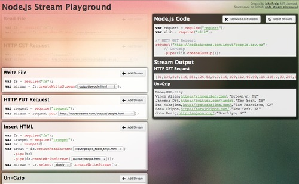

<!-- .slide: class="stamp" data-background-video="img/giphy-stream.mp4" data-background-video-loop="true" data-background-video-mute="true" -->

# The Power of Node.js Streams

<small>Version 0.1.0</small>

<small>by Paulo Diovani</small>

====
<!-- .slide: id="not-a-todo" class="bigtext" -->

This is not

a how-to

Note:
No tutorials on implementing streams.
You can find them on nodejs.org

----

## Working with...

- Copy files from http and backup on Amazon S3
- Decompress / Compress large files with zip / gzip
- Convert among TSV / CSV / JSON formats
- Publish videos on youtube

====

- Files with 100MB or more
- Upload can take several minutes on slow networks
- Low storage servers cannot host the files during transfer

====

Files are not transferred once,<br>
but byte by byte.


```bash
cp foo.txt bar.txt
```

Note:
We use so see file transfer as if they
are instantly copied...

====

Common file operations buffers the entire content in memory.

```javascript
const data = fs.readFileSync('/old/path/1gbFile.dat')

// data stores 1gb in memory until freed

fs.writeFileSync('/new/path/1gbFile.dat', data)
```

====

Streams flows data from source to destination.

```javascript
const readStream = fs.createReadStream('/old/path/1gbFile.dat')
const writeStream = fs.createWriteStream('/new/path/1gbFile.dat')

// minimal memory usage
readStream.pipe(writeStream)
```

----
<!-- .slide: id="streams" class="bigtext stamp" data-background-video="img/giphy-stream.mp4" data-background-video-loop="true" data-background-video-mute="true" -->

# Streams

====
<!-- .slide: id="over-time" class="bigtext" -->

_a stream is a sequence_

_of data elements made_

_available over time_

====
<!-- .slide: id="unlimited" class="bigtext" -->

_streams have potentially_

_unlimited data_

Note:
For example, logs from a server.

====

- Reads/Writes data sequentially
- Do not allow random access
- Allow transformations
- Allow monitoring
- Use just small amounts of memory

====

Streams exists in many different languages

```cpp
//c
#include <iotream>
#include <fstream>
```

```java
//java
import java.io.FileInputStream;
import java.io.FileOutputStream;
```

```bash
#bash
< /old/path/1gbFile.dat > /new/path/1gbFile.dat
```

----

## Node.js Streams

...are widely used by other classes or libraries

- `crypto`
- `fs`
- `http`
- `net`
- `process`
- `zlib`

<!-- .element: class="tag-list" -->

- `express`
- `hapi`
- `gulp`
- `request`
- etc

<!-- .element: class="tag-list" -->

====

Example: Send file through https

```javascript
const fs = require('fs')
const http = require('http')

const server = http.createServer((req, res) => {
  fs.createReadStream('./filename.txt')
    .pipe(res)
})

server.listen(8080)
```

----

### The pipe() ~~operator~~ method

Takes a readable source stream and hooks the output to a
destination writable stream. Then returns the destination
stream.

```javascript
readable.pipe(writable)
```

====

It is possible to attach multiple Writable streams to a single Readable stream.

```javascript
const r = fs.createReadStream('file.txt')
const z = zlib.createGzip()
const w = fs.createWriteStream('file.txt.gz')

r.pipe(z).pipe(w)
```

Note:
This is a_pipeline_

====

Same as (in bash)...

```bash
< file.txt | gzip -c > file.txt.gz
```

====

```javascript
a.pipe(b).pipe(c).pipe(d)
```

Same as...

```javascript
a.pipe(b)
b.pipe(c)
c.pipe(d)
```

Same as in command line...

```bash
a | b | c | d
```

====

`.pipe()` also handles backpressure automatically so that
node won't buffer chunks into memory needlessly

Note:
e.g. If the client can't read, the readable stream
won't send data

----

### Types of Node.js Streams

- Readable
- Writable
- Duplex
- Transform
- PassThrough

----

### Events in Streams

(mostly used)

- `readable`
- `data`
- `error`
- `end`

====

```javascript
const readable = getReadableStreamSomehow()

readable.on('data', (chunk) => {
  console.log(`Received ${chunk.length} bytes of data.`)
})

readable.on('end', () => {
  console.log('There will be no more data.')
})

readable.on('error', (err) => {
  console.error('An error ocurred.', err)
})
```

----

## What to do with Streams?

====

### Transfer large files

- Do not store the entire file on memory
- Do not emit data when no one is reading
- Allow monitoring

====

#### Post stream through http

```javascript
const fs = require('fs')
const request = require('request')

// post through http
fs.createReadStream('/old/path/file.json')
  .pipe(request.post('http://example.com/add'))
```

====

#### Fetch stream from Amazon S3

```javascript
// create read stream from s3 object
const readStream = s3.getObject({
  Bucket: S3_BUCKET,
  Key: S3_KEY
}).createReadStream()
```

====

#### Upload stream (video) to YouTube

```javascript
// upload to youtube
youtube.videos.insert({
  auth: AUTH_TOKEN,
  part: 'snippet,status',
  notifySubscribers: false,
  stabilize: false,
  resource: {
    snippet: { title: VIDEO_TITLE, description: VIDEO_DESCRIPTION },
    status: { privacyStatus: 'private' }
  },
  media: { body: readStream }
}, (err, data) => {
  if (err) return console.error('An error ocurred', err)
  console.log('Finished uploading video', data)
})
```

----

### Monitor data

- Analyze data during transfer / transformation
- Show progress or other importante info
- Format logs for humans

====

#### Show progress

```javascript
// show transfer progress
const size = 54000
let uploaded = 0

const interval = setInterval(() => {
  debug(`Upload progress at ${Math.floor(uploaded / size * 100)}%`)
}, 5000)

readStream.on('data', (chunk) => (uploaded += chunk.length))
readStream.on('end', () => clearInterval(interval))
```

Note:
There are public node modules for that,
for example `progress-stream`

====

```
Uploading video to youtube +2ms
Upload progress at 1% +5s
Upload progress at 4% +5s
Upload progress at 8% +5s
Upload progress at 12% +5s
Upload progress at 15% +5s
Upload progress at 21% +5s
Upload progress at 25% +5s
Upload progress at 30% +5s
Upload progress at 35% +5s
Upload progress at 41% +5s
...
```

Note:
Output from previous progress fn

----

### Transform data

- Sanitize or modify data
- Change format
- Filter

====

#### Download from sftp, unzip, gzip, upload to s3

```javascript
const readStream = sftp.get('/download/sales20171101.zip')
  .pipe(unzip.Parse())
  .pipe(zlib.createGzip())

s3.upload({
  Bucket: S3_BUCKET,
  Key: S3_KEY,
  Body: readStream
})
```

====

#### Get body from webpage and strip tag-list

```javascript
request('http://example.com')
  .pipe(xpath('//html/body'))
  .pipe(toString)
  .pipe(strip())
  .pipe(process.stdout)
```

----

### Other applications

- Communication
- Real time monitoring
- Audio / Video editing

====

### Stream helper libraries

- [`from`](https://github.com/dominictarr/from)
- [`through2`](https://github.com/rvagg/through2)
- [`concat-stream`](https://github.com/maxogden/concat-stream)
- [`split`](https://github.com/dominictarr/split)
- [`trumpet`](https://github.com/substack/node-trumpet)
- [`JSONStream`](https://github.com/dominictarr/JSONStream)
- [`xpath-stream`](https://github.com/nbqx/xpath-stream)
- ...

====

### Resources and learning

- [Node.js Stream Documentation](https://nodejs.org/api/stream.html)
- [Stream Handbook](https://github.com/substack/stream-handbook)
- [NodeSchool.io Stream Adventure](https://www.github.com/substack/stream-adventure) <small>(possibly outdated)</small>

====

### Node Stream Playground

[jeresig/node-stream-playground](https://github.com/jeresig/node-stream-playground)




<small>Currently offline. :(</small>

----
<!-- .slide: class="half-slide" data-background="url(img/paulodiovani.jpg)" data-background-size="contain" data-background-repeat="no-repeat" data-background-position="right" -->

### <i class="fa fa-user"></i> Paulo Diovani Gonçalves

<small>Technologist in Internet Systems by Feevale University.
Software Enginer at Codeminer 42.
GNU/Linux user since 2005.</small>

[blog.diovani.com][blog]

[slides.diovani.com][slides]

[@paulodiovani][twitter]

[![codeminer42][code-logo]][code-site] <!-- .element: class="no-border no-background" -->

[blog]: http://blog.diovani.com
[slides]: http://slides.diovani.com
[twitter]: http://twitter.com/paulodiovani
[code-logo]: img/codeminer42.png
[code-site]: http://codeminer42.com/

====
<!-- .slide: data-background="linear-gradient(rgba(255, 255, 255, 0.6), rgba(255, 255, 255, 0.6)), url(img/vod-meetup.jpg)" data-background-size="cover" -->

 <!-- .element: class="no-border no-background" -->
##  Valley of Developers

[valleyofdevelopers.github.io](https://valleyofdevelopers.github.io/)

<small>18 de Novembro<br>
Universidade Feevale, Novo Hamburgo - RS</small>
====

 <!-- .element: style="width: 50%" class="no-border" -->

[insiter.io](http://insiter.io/)

<small>02 de Dezembro<br>
Auditório do SENAC POA</small>
