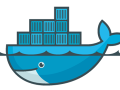

 <!-- .element: class="no-border no-background" -->

## Docker

[docker.com](https://www.docker.com)

====

> ### Build, Ship, Run
>
> Uma plataforma aberta de aplicações distribuídas
> para desenvolvedores e administradores de
> sistemas

====

- Sistema de arquivos em camadas
- Ampla variedade de imagens base
- Imagens nunca são alteradas, apenas o container sobre elas
- Rodam como serviços

====

 <!-- .element: class="no-border no-background bigger" -->

redhat.com <!-- .element: class="credits" -->

====

```
➜  ~  docker pull hello-world
latest: Pulling from hello-world

535020c3e8ad: Pull complete
af340544ed62: Pull complete
hello-world:latest: The image you are pulling has been verified.
Important: image verification is a tech preview feature and
should not be relied on to provide security.

Digest: sha256:02fee8c3220ba806531f606525eceb83f4feb654f62b207191b1c9209188dedd
Status: Downloaded newer image for hello-world:latest
```

====

```
➜  ~  docker run hello-world

Hello from Docker.
This message shows that your installation appears to be working correctly.

To generate this message, Docker took the following steps:
 1. The Docker client contacted the Docker daemon.
 2. The Docker daemon pulled the "hello-world" image from the Docker Hub.
 3. The Docker daemon created a new container from that image which runs the
    executable that produces the output you are currently reading.
 4. The Docker daemon streamed that output to the Docker client, which sent it
    to your terminal.

To try something more ambitious, you can run an Ubuntu container with:
 $ docker run -it ubuntu bash

Share images, automate workflows, and more with a free Docker Hub account:
 https://hub.docker.com

For more examples and ideas, visit:
 https://docs.docker.com/userguide/
```

Note:
Notem que ele roda um comando e pára.

Se este comando é um serviço e continua executando
o container vai continuar ativo, caso contrário
será terminado.

====

### Dockerfile

Docker _build system_

- cria novas imagens a partir de uma imagem base
- permite distribuir apenas um arquivo ao invés
  da imagem pronta

====

```Dockerfile
FROM docker/whalesay:latest

RUN apt-get -qq update \
    && apt-get -qq --force-yes install fortunes

CMD /usr/games/fortune -a | cowsay
```

Note:
Exemplo de Dockerfile

====

```
➜  ~  docker build -t docker-whale .
Sending build context to Docker daemon 2.048 kB
Sending build context to Docker daemon
Step 0 : FROM docker/whalesay:latest
 ---> fb434121fc77
Step 1 : RUN apt-get -qq update && apt-get -qq --force-yes install fortunes
 ---> Using cache
 ---> 0c9d9387db18
Step 2 : CMD /usr/games/fortune -a | cowsay
 ---> Using cache
 ---> 9970f489cd29
Successfully built 9970f489cd29
```

====

```
➜  ~  docker run docker-whale
 ____________________________
< Just to have it is enough. >
 ----------------------------
    \
     \
      \
                    ##        .
              ## ## ##       ==
           ## ## ## ##      ===
       /""""""""""""""""___/ ===
  ~~~ {~~ ~~~~ ~~~ ~~~~ ~~ ~ /  ===- ~~~
       \______ o          __/
        \    \        __/
          \____\______/

```

Note:
- Cria uma imagem a partir de um `Dockerfile`
- Roda um container a partir da imagem

====
<!-- .slide: class="list-descriptions" -->

- Docker

    Cria e roda Docker Containers.

- Docker Hub

    Serviço de registro e hospedagem de imagens.

- Docker Machine

    Aumatiza o provisionamento de containers em sua rede
    ou na Nuvem.

- Docker Compose

    Define aplicações _multi-containers_.

Note:
Ferramentas da suíte Docker

====

### Que problemas resolve?

- Isolamento de _userspace_ e estrutura de diretórios
- Build system (com `Dockerfile`)
- Reproduzir ambientes facilmente (com Docker Compose)
- Distribuição
- Não restrito a Linux Host (com `boot2docker` ou Docker Machine)

====

### Obstáculos

- Containers como serviços
- Ambientes não Linux exigem o uso de uma VM
