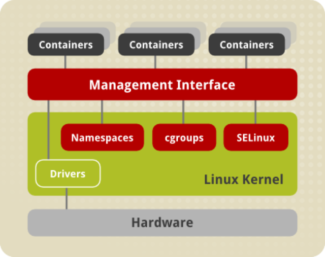

 <!-- .element: class="no-border no-background" -->

## Linux Containers

[linuxcontainers.org](https://linuxcontainers.org)

====

> Algo entre um _chroot_ e uma máquina virtual completa

====

- Utiliza características de contenção do kernel Linux
- Roda no sistema de arquivos
- Compartilha o _Kernel_ com o _Host_

====

 <!-- .element: class="no-border no-background bigger" -->

redhat.com <!-- .element: class="credits" -->

Note:
Arquitetura de containers

====

```
➜  ~ lxc-create -t download -n my-container
---

Distribution: debian
Release: wheezy
Architecture: amd64

Downloading the image index
Downloading the rootfs
Downloading the metadata
The image cache is now ready
Unpacking the rootfs

---
You just created a Debian container (release=wheezy, arch=amd64,
variant=default)

To enable sshd, run: apt-get install openssh-server

For security reason, container images ship without user accounts
and without a root password.

Use lxc-attach or chroot directly into the rootfs to set a root password
or create user accounts.
```

Note:
Cria um novo container.

Com `-t download` uma lista de imagens é apresentada
para escolha.

====

```
➜  ~ lxc-start -n my-container -d

➜  ~ lxc-ls -f
NAME          STATE    IPV4       IPV6  GROUPS  AUTOSTART
 -------------------------------------------------------
my-container  RUNNING  10.0.3.34  -     -       NO

➜  ~ lxc-info -n my-container
Name:           my-container
State:          RUNNING
PID:            16499
IP:             10.0.3.34
U use:        0.57 seconds
BlkIO use:      228.00 KiB
Memory use:     3.31 MiB
KMem use:       0 bytes
Link:           vethT7YK2O
 TX bytes:      1.34 KiB
 RX bytes:      4.81 KiB
 Total bytes:   6.16 KiB
```

Note:
Visualiza informações do container.

====

```
➜  ~ lxc-attach -n my-container

root@my-container:/#
root@my-container:/# uname -a
Linux my-container 3.19.0-28-generic #30-Ubuntu SMP
Mon Aug 31 15:52:51 UTC 2015
x86_64 GNU/Linux

root@my-container:/# ^D

➜  ~ lxc-stop -n my-container
➜  ~ lxc-destroy -n my-container
```

Note:
- Acessa o shell do container
- Pára, remove o container

====
<!-- .slide: class="list-descriptions" -->

- LXC

    Interface de _userspace_ para as capacidades de contenção
    do Kernel Linux.

- LXD

    _Container hypervisor_ e uma nova experiência de usuário
    para LXC.

- CG Manager

    Serviço centralizado para gerenciar _cgroups_.

- LXCFS

    Sistema de arquivos sobre _userspace_ desenvolvido para
    resolver algumas limitações do Kernel linux.

Note:
Conjunto de ferramentas do projeto Liunx Containers

====

### Que problemas resolve?

- Isolamento de _userspace_ e estrutura de diretórios
- Uso transparente, semelhante a uma VM

Note:
_Heroku_ é um exemplo de _hosting_ que utiliza LXC
em sua infraestrutura.

====

### Obstáculos

- Apenas GNU/Linux
- Muito verboso, difícil de gerenciar ou automatizar

Note:
_Heroku_ possui seu próprio sistema de _buildpacks_.
