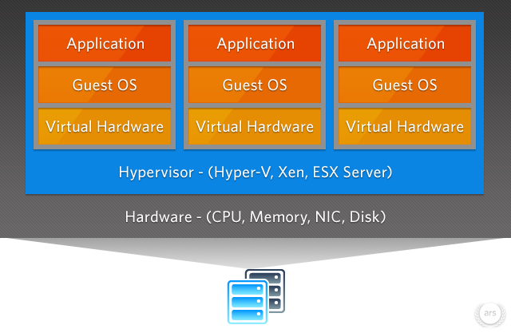

<!-- .slide: data-background="img/snes9x-mariocart.png" -->

Primeiro vamos falar sobre

## Virtualização

snes9x.com <!-- .element: class="credits" -->

Note:
Emuladores de videgames não são muito diferentes de
hypervisors.

====

Começou na década de 60 como uma forma de dividir recursos
de um _mainframe_ entre diferentes aplicações.

Note:
Meu contato foi por volta do ano 2000

====

arstechnica.com <!-- .element: class="credits" -->

====

- Depende de emulação de Hardware
- Qualquer Sistema Operacional
- Reserva recursos (especialmente memória)
- Performance comprometida

Note:
Principais características

====

 <!-- .element: class="no-border no-background" -->
 <!-- .element: class="no-border no-background" -->
 <!-- .element: class="no-border no-background" -->
 <!-- .element: class="no-border no-background" -->

- KVM
- Virtual Box
- VM Ware
- Windows Hyper-V
- Xen

Note:
Alguns exemplos de Hypervisors conhecidos
